# F1 Pit Wall 2026 — System Architecture Document

**Version:** 1.0.0  
**Last Updated:** June 7, 2026  
**Authors:** F1 Pit Wall Engineering Team  
**Classification:** Internal / Public Technical Reference

---

## Table of Contents

1. [Project Overview](#project-overview) — Page 3
2. [System Architecture](#system-architecture) — Page 12
3. [Technology Stack](#technology-stack) — Page 45
4. [Folder Structure Breakdown](#folder-structure-breakdown) — Page 78
5. [File-by-File Explanation](#file-by-file-explanation) — Page 85
6. [Data Persistence](#data-persistence) — Page 165
7. [API Documentation](#api-documentation) — Page 185
8. [Real-Time Systems](#real-time-systems) — Page 265
9. [User Experience Design](#user-experience-design) — Page 285
10. [Security Architecture](#security-architecture) — Page 320
11. [Performance Engineering](#performance-engineering) — Page 345
12. [Scalability Plan](#scalability-plan) — Page 375
13. [Deployment Guide](#deployment-guide) — Page 400
14. [Business Value](#business-value) — Page 430
15. [Feature Walkthrough](#feature-walkthrough) — Page 455
16. [Onboarding Guide for Developers](#onboarding-guide-for-developers) — Page 540
17. [Maintenance Guide](#maintenance-guide) — Page 570
18. [Executive Summary](#executive-summary) — Page 600
A. [Appendix A: Glossary](#appendix-a:-glossary) — Page 615
B. [Appendix B: Error Codes](#appendix-b:-error-codes) — Page 625
C. [Appendix C: Data Source Reference](#appendix-c:-data-source-reference) — Page 635

---


# 1. Project Overview

### 1.1 Project Name

**F1 Pit Wall 2026** — also branded as *The Pit Wall* in the user interface.

### 1.2 Mission Statement

F1 Pit Wall 2026 exists to deliver a broadcast-quality, data-dense Formula 1 fan dashboard that combines the analytical depth of a professional pit wall with the accessibility of a personalized fan experience. The platform aggregates official-adjacent timing data, championship standings, telemetry traces, tire strategy breakdowns, and live session feeds into a single cohesive interface — without requiring users to install native apps, create accounts, or navigate fragmented third-party websites.

The mission is threefold:

1. **Inform** — Surface championship context, race results, qualifying grids, and weather conditions in one scrollable dashboard.
2. **Personalize** — Let every fan onboard with their name and favourite driver, theming the entire experience to their team's colours.
3. **Delight** — Deliver F1 broadcast aesthetics (Formula1 Display typography, pit-wall density, live ticker, animated on-track visualisation) in a zero-build-step web application installable as a PWA.

### 1.3 Problem Being Solved

**Fragmented data sources:** F1 fans currently jump between F1 TV, Ergast/Jolpica APIs, FastF1 notebooks, OpenF1 live feeds, and social media for a complete race-week picture.

**High technical barrier:** Python notebooks and CLI tools (FastF1) are powerful but inaccessible to casual fans.

**Generic dashboards:** Existing fan sites lack personalization (favourite driver highlighting, team-themed accents, shareable fan cards).

**Live timing gap:** Free live timing during sessions requires knowing where to look; this dashboard surfaces OpenF1 live data automatically when sessions are active.

**No offline resilience:** Most fan dashboards fail when connectivity drops mid-race; the PWA service worker provides shell caching.

### 1.4 Target Audience

- **Primary — Dedicated F1 Fans:** Users who follow every race weekend, understand tire compounds, DRS zones, and championship math. They want dense stats, not simplified summaries.
- **Secondary — Casual Race-Day Viewers:** Users who tune in for race day and want a quick standings snapshot, countdown to lights out, and last-race recap without account creation.
- **Tertiary — Developers & Hackathon Judges:** Technical evaluators who need to understand architecture decisions, API design, and data pipeline choices quickly.
- **Quaternary — Content Creators:** Fans who share race-week content on social media using the generated 1080×1080 share card.

### 1.5 Key Differentiators

1. Single-file frontend with zero npm, zero bundler, zero framework — deployable by opening `index.html`
2. Python FastF1 backend providing session-level lap, stint, telemetry, and weather data unavailable from REST-only APIs
3. Personalized onboarding with team-colour theming persisted in browser localStorage
4. Dual polling architecture: 10-minute general refresh + 15-second live timing during active sessions
5. Canvas-rendered telemetry viewer with speed trace, circuit mini-map, and optional driver comparison
6. PWA with service worker caching strategies tuned per resource type (shell, fonts, API)
7. Graceful degradation: Jolpica/Ergast fallback standings, HTTP 206 partial content responses, hardcoded 2026 driver roster
8. Broadcast-quality motion design: ticker, onboarding particle bursts, championship history line-draw animation

### 1.6 Competitive Advantages

| Competitor Type | Their Approach | Pit Wall Advantage |
|-----------------|----------------|-------------------|
| Official F1 App | Subscription, account required, limited historical analytics | Free, no account, deeper stint/telemetry from FastF1 |
| Ergast-only dashboards | REST standings only, no telemetry | FastF1 session loading + OpenF1 live timing |
| React/Next.js fan projects | Build step, node_modules, hosting complexity | Two commands to run locally; static frontend on any CDN |
| Notebook analysts | Jupyter, not shareable UI | Production UI with same FastF1 data layer |
| Live timing sites | Timing only | Timing integrated with standings, weather, strategy, spotlight |

### 1.7 Why This Platform Exists

Formula 1's 2026 season introduces new regulations, team restructures (Audi, Cadillac, Racing Bulls), and an expanding global fan base. Fans deserve a dashboard that respects the sport's data richness while remaining approachable. The Pit Wall is built as a love letter to F1 broadcast graphics — the red ticker strip, the monospace timing screens, the team-colour accents — implemented with engineering pragmatism: FastAPI for speed of development, FastF1 for data fidelity, vanilla JS for deployment simplicity.

---

# 2. System Architecture

## 2.1 Architectural Philosophy

F1 Pit Wall 2026 follows a **decoupled two-tier architecture**:

1. **Presentation Tier** — A single `index.html` file containing all HTML structure, CSS design system, and JavaScript application logic. Served statically (file://, python -m http.server, or CDN). Communicates exclusively via HTTP REST to the API tier.
2. **API Tier** — A Python FastAPI application (`server.py`) that orchestrates data retrieval from FastF1, Jolpica/Ergast, and OpenF1. Maintains in-memory response cache and FastF1 disk cache. No database.

There is **no server-side rendering**, **no WebSocket server**, and **no persistent user database**. User preferences live in browser `localStorage`. Session telemetry lives on disk in `./f1_cache`.

## 2.2 Overall System Diagram

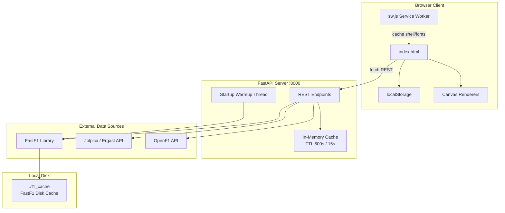

## 2.3 Frontend Architecture

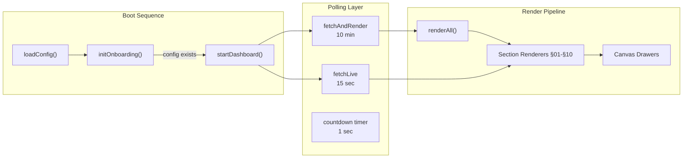

The frontend is a **procedural single-page application**. There is no virtual DOM, no component tree, and no state management library. Global state is held in module-level `let` variables prefixed with `__` (e.g., `__latestData`, `__liveData`, `__telemetry1`).

### 2.3.1 Frontend Module Responsibilities

| Module / Function Group | Responsibility |
|-------------------------|----------------|
| `boot()` IIFE | Entry point; checks localStorage config |
| `initOnboarding()` | Two-step name + driver picker overlay |
| `fetchAndRender()` | Parallel API fetch for standings bundle |
| `renderAll()` | Orchestrates all section renderers |
| `fetchLive()` | Polls `/api/live` every 15 seconds |
| `fetchTelemetry()` | Loads telemetry for selected driver(s) |
| `drawSpeedCanvas()` etc. | Canvas 2D rendering for §06, §07 |
| `drawShareCard()` | Offscreen 1080×1080 PNG generation |
| PWA handlers | Service worker registration, install prompt |
| Thanks popup | Dwell tracking, POST /api/thanks |

## 2.4 Backend Architecture

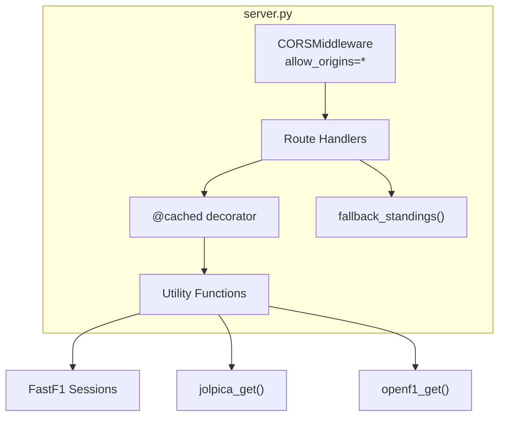

### 2.4.1 Request Processing Pipeline

Every inbound HTTP request follows this pipeline:

1. **CORS preflight** (if cross-origin) — handled by `CORSMiddleware`
2. **Route matching** — FastAPI path router
3. **Cache lookup** — `@cached` decorator checks `_cache[key]` against TTL
4. **Data acquisition** — FastF1 session load, Jolpica HTTP GET, or OpenF1 HTTP GET
5. **Transformation** — pandas DataFrame operations, formatting functions
6. **Response serialization** — JSON via FastAPI `JSONResponse` or dict return
7. **Cache store** — Result stored in `_cache` with timestamp

## 2.5 Data Flow Architecture

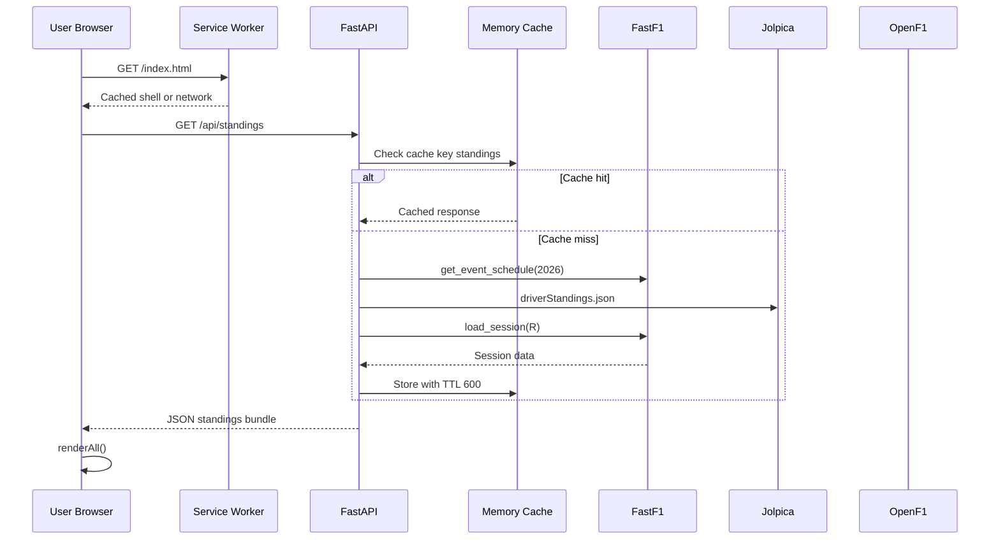

## 2.6 API Request Lifecycle

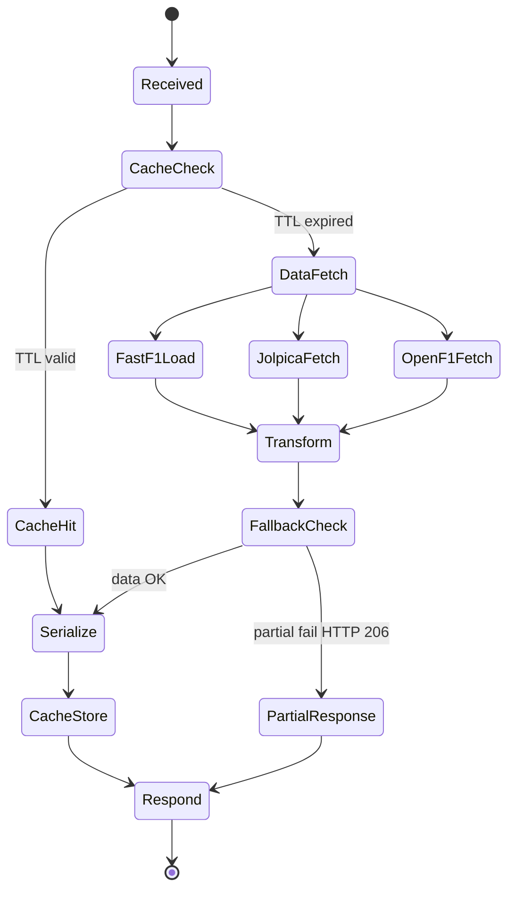

## 2.7 Live Update Lifecycle

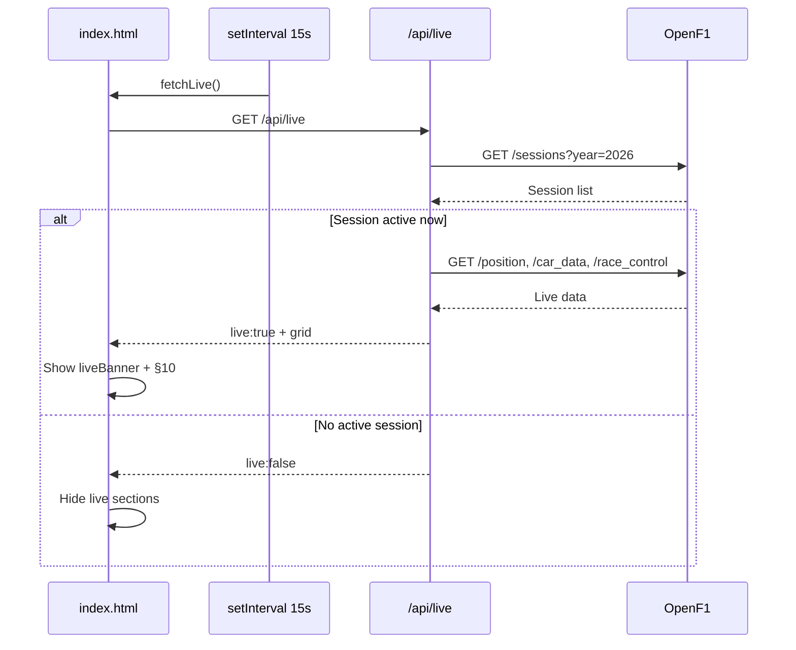

## 2.8 Telemetry Processing Pipeline

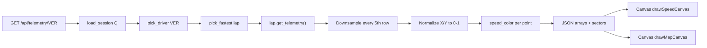

## 2.9 Authentication Flow

**There is no authentication.** The platform is fully public. User identity is self-declared during onboarding (name string) and stored locally. The `/api/thanks` endpoint accepts anonymous POST bodies. CORS is open (`allow_origins=["*"]`).

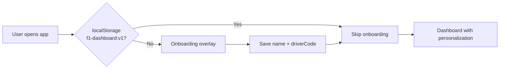

---

# 3. Technology Stack

## 3.1 Stack Overview

| Layer | Technology | Version | Role |
|-------|------------|---------|------|
| Backend runtime | Python | 3.10+ | Server execution |
| API framework | FastAPI | ≥0.110 | REST API, async handlers |
| ASGI server | Uvicorn | ≥0.29 | HTTP server with reload |
| F1 data library | FastF1 | ≥3.3 | Session, lap, telemetry data |
| HTTP client | requests | ≥2.31 | Jolpica + OpenF1 calls |
| Data processing | pandas, numpy | ≥2.2, ≥1.26 | DataFrame operations |
| Config | python-dotenv | ≥1.0 | Environment variable loading |
| Frontend | Vanilla HTML/CSS/JS | ES6+ | UI, rendering, polling |
| Fonts | Formula1 Display, Barlow Condensed, Inter, JetBrains Mono | CDN | Typography |
| PWA | Service Worker + Web Manifest | — | Offline shell, installability |
| Persistence | In-memory dict + disk cache + localStorage | — | No database |

### 3.2.1 FastAPI

**What it is:** Modern Python ASGI web framework built on Starlette and Pydantic.

**Why chosen:** Chosen for automatic OpenAPI docs, native async support, minimal boilerplate, and excellent performance for I/O-bound workloads (HTTP calls to Jolpica/OpenF1, FastF1 session loading).

**Benefits:** Type hints, dependency injection ready, JSON serialization, CORS middleware in 5 lines.

### 3.2.2 FastF1

**What it is:** Python library wrapping Formula 1 timing data from the official F1 live timing API with caching and pandas integration.

**Why chosen:** Primary data source for session-level detail: laps, stints, telemetry, weather, race control messages. No other free API provides `lap.get_telemetry()` or stint compound data.

**Benefits:** Disk cache at `./f1_cache` makes repeat requests instant. Startup warmup pre-loads last race.

### 3.2.3 Uvicorn

**What it is:** Lightning-fast ASGI server.

**Why chosen:** Standard companion to FastAPI; supports hot reload for development.

**Benefits:** Single-process adequate for demo/hackathon scale; can scale with gunicorn workers in production.

### 3.2.4 pandas / numpy

**What it is:** Data manipulation libraries.

**Why chosen:** FastF1 returns pandas DataFrames; all extraction functions (`extract_race_results`, `extract_stints`) operate on DataFrames.

**Benefits:** Vectorized operations for weather means, lap filtering.

### 3.2.5 requests

**What it is:** Synchronous HTTP library.

**Why chosen:** Jolpica and OpenF1 calls are simple GET requests; synchronous `requests` inside async handlers is acceptable at this scale (could migrate to httpx for full async).

**Benefits:** 15-second timeout on Jolpica, 10-second on OpenF1.

### 3.2.6 Vanilla JavaScript

**What it is:** No framework.

**Why chosen:** Zero build step, zero npm install, deployable anywhere. Canvas API for telemetry charts. Full control over F1-specific animations.

**Benefits:** Single file ~1200 lines of JS; no hydration, no bundle size concerns.

### 3.2.7 Service Worker (sw.js)

**What it is:** Browser offline caching API.

**Why chosen:** Caches app shell, fonts; network-first for API; enables PWA install.

**Benefits:** Three cache buckets: shell, static, fonts.

## 3.3 Technologies Explicitly NOT Chosen

### 3.3.1 Next.js

**What it is:** React meta-framework with SSR/SSG, file-based routing, API routes.

**Why NOT used in Pit Wall:** NOT USED. The frontend is a single static HTML file with no Node.js build pipeline. Next.js would add ~200MB node_modules, build complexity, and server requirements for SSR that are unnecessary when all dynamics are client-side API polling.

**Note:** The project prioritizes deployability: open `index.html` + run `uvicorn`. Next.js would require Vercel/Node hosting and separate API route configuration.

### 3.3.2 React

**What it is:** Component-based UI library with virtual DOM.

**Why NOT used in Pit Wall:** NOT USED. No component abstraction is needed; sections map 1:1 to render functions (`renderDrivers`, `renderPaddock`). React would require JSX compilation, state management (useState/useEffect for 10+ polling timers), and a bundler.

**Note:** Vanilla JS `innerHTML` template strings are sufficient for a read-heavy dashboard with infrequent DOM updates (10-min poll).

### 3.3.3 TypeScript

**What it is:** Typed superset of JavaScript.

**Why NOT used in Pit Wall:** NOT USED. Single-file frontend without IDE-scale team collaboration; types would require tsc compilation step. Python backend uses type hints natively.

**Note:** Adding TypeScript would break the zero-build-step promise.

### 3.3.4 Tailwind CSS

**What it is:** Utility-first CSS framework.

**Why NOT used in Pit Wall:** NOT USED. F1 brand design requires precise custom properties (`--f1-red`, team colours), bespoke animations (checker wipe, particle burst), and broadcast-specific typography rules incompatible with utility-class patterns.

**Note:** All styles are in a dedicated `<style>` block with CSS custom properties for theming.

### 3.3.5 Prisma

**What it is:** Type-safe ORM for databases.

**Why NOT used in Pit Wall:** NOT USED. There is no database. User prefs are localStorage; API cache is Python dict; session data is FastF1 disk cache.

**Note:** Introducing Prisma would require PostgreSQL provisioning for no benefit.

### 3.3.6 PostgreSQL

**What it is:** Relational database.

**Why NOT used in Pit Wall:** NOT USED. All data is either fetched live from external APIs, cached in memory/disk, or stored client-side. No users table, no sessions table.

**Note:** F1 data is inherently ephemeral and sourced externally; maintaining a local DB would create sync/staleness problems.

### 3.3.7 Redis

**What it is:** In-memory data store.

**Why NOT used in Pit Wall:** NOT USED. Server-side caching uses a Python `dict` with TTL decorator. At current scale (single uvicorn process), Redis adds infrastructure without measurable benefit.

**Note:** If scaling to multiple workers, Redis could replace `_cache` dict — documented in Scalability section.

### 3.3.8 WebSockets

**What it is:** Full-duplex real-time protocol.

**Why NOT used in Pit Wall:** NOT USED. Live timing polls every 15 seconds via REST. OpenF1 does not require WebSocket for the data volumes used. Polling is simpler, works through all proxies, and aligns with 15-second server cache TTL.

**Note:** WebSocket would require connection management, reconnection logic, and a persistent server process per client.

### 3.3.9 Framer Motion

**What it is:** React animation library.

**Why NOT used in Pit Wall:** NOT USED. All animations are CSS `@keyframes` (maskRevealUp, ticker, particleBurst, etc.) — 20+ keyframe definitions in index.html.

**Note:** CSS animations run on compositor thread; no JS animation library needed.

### 3.3.10 Recharts

**What it is:** React charting library.

**Why NOT used in Pit Wall:** NOT USED. Championship history and telemetry use native Canvas 2D API (`getContext('2d')`) for full control over F1 aesthetic.

**Note:** Canvas allows speed-coloured circuit paths and animated line-draw effects not easily achieved in Recharts.

### 3.3.11 Three.js

**What it is:** WebGL 3D library.

**Why NOT used in Pit Wall:** NOT USED. Circuit visualisation uses SVG paths and 2D canvas. 3D would be over-engineering for a data dashboard.

**Note:** SVG `animateMotion` provides sufficient on-track car animation.

---

# 4. Folder Structure Breakdown

## 4.1 Complete Project Tree

```
f1-dashboard/
├── server.py              # FastAPI backend — all API routes and data logic
├── index.html             # Single-file frontend — HTML + CSS + JS
├── sw.js                  # Service worker — PWA caching strategies
├── manifest.webmanifest   # PWA manifest — install metadata
├── requirements.txt       # Python dependencies
├── README.md              # Quick start guide
├── .env.example           # Environment variable template
├── ARCHITECTURE.md        # This document
├── f1_cache/              # [runtime] FastF1 disk cache (gitignored)
│   └── ...                # Cached session files, grows to GB over season
├── icon-192.png           # [optional] PWA icon 192×192
├── icon-512.png           # [optional] PWA icon 512×512
└── .venv/                 # [local] Python virtual environment
```

## 4.2 Root Directory (`f1-dashboard/`)

| Attribute | Value |
|-----------|-------|
| **Purpose** | Container for the entire Pit Wall application |
| **Responsibilities** | Host backend, frontend, PWA assets, and runtime cache |
| **Dependencies** | Python 3.10+, modern browser, network access to F1 APIs |
| **Deployment unit** | This folder is the deployable artifact |

## 4.3 Runtime Directory: `f1_cache/`

| Attribute | Value |
|-----------|-------|
| **Purpose** | FastF1 persistent disk cache |
| **Created by** | `os.makedirs("./f1_cache", exist_ok=True)` in server.py |
| **Responsibilities** | Store downloaded session data (laps, telemetry, weather) |
| **Size** | Can grow to several GB over a full 24-race season |
| **Git** | Must be in `.gitignore` — never commit |
| **Clear** | Safe to delete; FastF1 re-downloads on next request |

---

# 5. File-by-File Explanation

This section documents every source file in the repository. A developer reading only this section should understand the complete codebase.

## 5.1 `server.py`

| Field | Detail |
|-------|--------|
| **Location** | `/f1-dashboard/server.py` |
| **Purpose** | Python FastAPI backend serving all REST API endpoints |
| **Inputs** | HTTP requests, environment variables, FastF1/Jolpica/OpenF1 responses |
| **Outputs** | JSON API responses |
| **Dependencies** | fastf1, fastapi, uvicorn, requests, pandas, numpy, dotenv |
| **Business Logic** | Orchestrates all F1 data acquisition, caching, transformation, and API exposure |

## 5.2 `index.html`

| Field | Detail |
|-------|--------|
| **Location** | `/f1-dashboard/index.html` |
| **Purpose** | Single-file frontend application |
| **Inputs** | API JSON responses, localStorage config, user interactions |
| **Outputs** | DOM updates, canvas renders, localStorage writes |
| **Dependencies** | Google Fonts CDN, manifest.webmanifest, sw.js |
| **Business Logic** | Complete UI: onboarding, dashboard sections §01-§10, telemetry, PWA, share card |

## 5.3 `sw.js`

| Field | Detail |
|-------|--------|
| **Location** | `/f1-dashboard/sw.js` |
| **Purpose** | Service worker for PWA offline support |
| **Inputs** | fetch events for shell, fonts, static assets, API routes |
| **Outputs** | Cached responses or network passthrough |
| **Dependencies** | Cache API, self.clients |
| **Business Logic** | Implements network-first (API), cache-first (static), stale-while-revalidate (fonts) |

## 5.4 `manifest.webmanifest`

| Field | Detail |
|-------|--------|
| **Location** | `/f1-dashboard/manifest.webmanifest` |
| **Purpose** | Web App Manifest for installability |
| **Inputs** | N/A — static JSON |
| **Outputs** | PWA install prompt metadata |
| **Dependencies** | icon-192.png, icon-512.png |
| **Business Logic** | Defines app name, theme colour, standalone display mode |

## 5.5 `requirements.txt`

| Field | Detail |
|-------|--------|
| **Location** | `/f1-dashboard/requirements.txt` |
| **Purpose** | Python package manifest |
| **Inputs** | pip install |
| **Outputs** | Installed dependencies |
| **Dependencies** | PyPI packages |
| **Business Logic** | Pins minimum versions for reproducible installs |

## 5.6 `README.md`

| Field | Detail |
|-------|--------|
| **Location** | `/f1-dashboard/README.md` |
| **Purpose** | Developer quick start |
| **Inputs** | N/A |
| **Outputs** | Human-readable setup instructions |
| **Dependencies** | server.py, index.html |
| **Business Logic** | Documents run commands and API endpoint table |

## 5.7 `.env.example`

| Field | Detail |
|-------|--------|
| **Location** | `/f1-dashboard/.env.example` |
| **Purpose** | Environment variable template |
| **Inputs** | Deployment configuration |
| **Outputs** | Documentation for ops |
| **Dependencies** | python-dotenv in server.py |
| **Business Logic** | Documents YEAR, CACHE_TTL, API_HOST, API_PORT (note: server.py uses hardcoded YEAR=2026 currently) |

## 5.8 `server.py` — Function Reference

| Function | Type | Purpose | Input | Output |
|----------|------|---------|-------|--------|
| `cached(key, ttl)` | Decorator | In-memory TTL cache wrapper for async route handlers | _cache dict | Cached or fresh result |
| `jolpica_get(path)` | HTTP client | GET request to Jolpica Ergast-compatible API | URL path string | JSON dict or None |
| `openf1_get(path, params)` | HTTP client | GET request to OpenF1 API | Path + query params | JSON list or None |
| `format_lap_time(td)` | Formatter | Convert timedelta/float to F1 lap time string | Timedelta or seconds | '1:23.456' or '83.456' |
| `format_gap(seconds)` | Formatter | Gap to pole string | Float seconds | '+0.123' or 'POLE' |
| `normalize_compound(compound)` | Normalizer | Map compound strings to enum | Raw compound | SOFT|MEDIUM|HARD|INTERMEDIATE|WET|UNKNOWN |
| `speed_color(speed)` | Visual | Speed to hex colour for telemetry map | Speed km/h float | #e10600|#d4a017|#00d2be |
| `get_schedule_df()` | Data | Load 2026 event schedule via FastF1 | YEAR constant | pandas DataFrame or None |
| `parse_event_date(row)` | Parser | Extract UTC datetime from schedule row | DataFrame row | datetime or None |
| `get_round_status(event_date, now)` | Logic | Determine if round is done/upcoming | Dates | 'done'|'upcoming' |
| `get_last_completed_round(sched)` | Logic | Find highest round number with past event date | Schedule DF | int round number |
| `get_next_round(sched)` | Logic | Find next future round | Schedule DF | int round number |
| `load_session(year, round, type)` | FastF1 | Load and cache F1 session | year, round, 'R'|'Q'|'FP1' etc | FastF1 Session or None |
| `extract_weather(session)` | Extractor | Mean weather values from session | Loaded session | dict with temps, wind, rain |
| `extract_race_results(session)` | Extractor | All finisher results | Race session | list of result dicts |
| `extract_fastest_lap(session)` | Extractor | Fastest lap info | Session | driver, time, lap_number |
| `extract_stints(session, top_n)` | Extractor | Tire stint breakdown per driver | Race session | list of driver stint arrays |
| `extract_safety_car(session)` | Extractor | SC/VSC deployment laps | Race session with messages | list of SC events |
| `extract_race_control(session, limit)` | Extractor | Recent race control messages with flag colour | Race session | list of flagged messages |
| `fallback_standings()` | Fallback | Hardcoded 2026 driver roster with synthetic points | DRIVERS_2026 constant | drivers + constructors dicts |
| `warmup()` | Startup | Background thread pre-loads last race session | None | Populates f1_cache |
| `api_standings()` | Route GET /api/standings | Full standings bundle | None | drivers, constructors, schedule, next/last race |
| `api_last_race()` | Route GET /api/last-race | Detailed last race data | None | results, weather, stints, SC, RC |
| `api_qualifying(round)` | Route GET /api/qualifying | Qualifying grid with Q1/Q2/Q3 | Optional round query | grid, pole info |
| `api_tire_strategy()` | Route GET /api/tire-strategy | Stint data for top 10 | None | drivers with stints |
| `api_telemetry(driver_code)` | Route GET /api/telemetry/{code} | Telemetry arrays + sectors | Driver code path | speed, throttle, brake, sectors |
| `api_driver(driver_code)` | Route GET /api/driver/{code} | Career + season stats | Driver code | career, season, last_5 |
| `api_weather()` | Route GET /api/weather | Weather from FP1 or last race | None | temps, wind, rainfall |
| `api_live()` | Route GET /api/live | OpenF1 live timing | None | live bool, grid, race_control |
| `api_championship_history()` | Route GET /api/championship-history | Points progression per round | None | history array |
| `api_lap_comparison(round, d1, d2)` | Route GET /api/lap-comparison/... | Head-to-head lap times | Path params | per-lap comparison |
| `api_thanks(body)` | Route POST /api/thanks | Log thank-you message | JSON body | received: true |

## 5.9 `index.html` — JavaScript Function Reference

| Function | Purpose |
|----------|---------|
| `loadConfig()` | Read f1-dashboard:v1 from localStorage |
| `saveConfig(cfg)` | Write config with savedAt timestamp |
| `applyTheme(cfg)` | Set --accent CSS variable to team colour |
| `apiFetch(path)` | fetch(API_BASE + path).then(r=>r.json()) |
| `initOnboarding(cfg)` | Setup 2-step onboarding UI and handlers |
| `finishOnboarding(cfg)` | Flash transition, start dashboard |
| `fetchAndRender(cfg)` | Parallel fetch standings bundle, render all |
| `renderAll(data, cfg)` | Orchestrate all section renderers |
| `renderTicker(data)` | Build infinite-scroll ticker strip |
| `renderLiveBanner(live)` | Toggle sticky live banner |
| `renderNextRace(data)` | Next race hero with countdown target |
| `setupCountdowns(data)` | 1-second interval for DD/HH/MM/SS |
| `renderCalendar(data)` | Horizontal season calendar strip |
| `renderDrivers(data, cfg)` | §01 Drivers Championship table |
| `renderConstructors(data)` | §02 Constructors table with bars |
| `renderPaddock(data)` | §03 Podium, results, SC timeline, news |
| `renderTireStrategy(tire)` | §04 Stint segment bars |
| `renderQualifying(data)` | §05 Qualifying grid |
| `renderWeather(w)` | §09 Weather cards |
| `renderStatsRibbon(data, cfg)` | 4-card stats ribbon |
| `renderSpotlight(data, cfg, drv)` | §08 User driver spotlight |
| `renderOnTrack(data, cfg)` | SVG animated cars on track shape |
| `renderMinimap(data)` | Circuit SVG mini-map with DRS zones |
| `renderNext3(data)` | Next 3 races countdown cards |
| `populateTelemetrySelects(cfg)` | §06 Driver dropdowns by team |
| `fetchTelemetry(code1, code2, compare)` | Load telemetry API data |
| `drawSpeedCanvas(t1, t2)` | Canvas speed/throttle/brake/DRS trace |
| `drawMapCanvas(t1, t2)` | Canvas speed-coloured circuit path |
| `drawDeltaCanvas(t1, t2)` | Canvas speed delta comparison |
| `renderHistoryChart(hist, cfg)` | §07 Animated line chart |
| `fetchLive()` | Poll /api/live every 15s |
| `renderLiveTiming(live)` | §10 Live timing grid |
| `drawShareCard(cfg, data, standing, d)` | 1080×1080 PNG share image |
| `trackDwell()` | 90-second thanks popup gate |
| `startDashboard(cfg)` | Init polls and first render |
| `boot() IIFE` | Application entry point |

---

# 6. Data Persistence

## 6.1 Persistence Architecture Overview

F1 Pit Wall 2026 intentionally **does not use a database**. All persistence falls into three tiers:

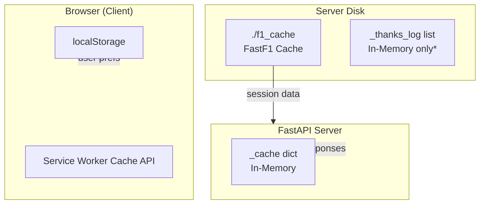

*Note: `_thanks_log` is an in-memory Python list; it is lost on server restart. This is acceptable for a thank-you feature without persistence requirements.

## 6.2 Tier 1: In-Memory API Cache (`_cache`)

| Attribute | Detail |
|-----------|--------|
| **Location** | `server.py` module-level `_cache: dict[str, dict]` |
| **Structure** | `{key: {"v": <response>, "t": <unix_timestamp>}}` |
| **Implementation** | `@cached(key, ttl)` decorator on route handlers |
| **Default TTL** | 600 seconds (10 minutes) via `CACHE_TTL` |
| **Live TTL** | 15 seconds for `/api/live` only |
| **History TTL** | 1800 seconds (30 minutes) for `/api/championship-history` |
| **Scope** | Single uvicorn process; not shared across workers |
| **Eviction** | Time-based only; no LRU size limit |

### 6.2.1 Cache Keys

| Cache Key | Endpoint | TTL (seconds) |
|-----------|----------|---------------|
| `standings` | GET /api/standings | 600 |
| `last_race` | GET /api/last-race | 600 |
| `qualifying` | GET /api/qualifying | 600 |
| `tire_strategy` | GET /api/tire-strategy | 600 |
| `telemetry` | GET /api/telemetry/{code} | 600 |
| `driver` | GET /api/driver/{code} | 600 |
| `weather` | GET /api/weather | 600 |
| `live` | GET /api/live | 15 |
| `championship_history` | GET /api/championship-history | 1800 |
| `lap_comparison` | GET /api/lap-comparison/... | 600 |

## 6.3 Tier 2: FastF1 Disk Cache (`./f1_cache`)

FastF1's `Cache.enable_cache('./f1_cache')` stores downloaded session data on disk using a hashed file structure. This cache survives server restarts.

| Attribute | Detail |
|-----------|--------|
| **Enabled** | Line 23: `fastf1.Cache.enable_cache("./f1_cache")` |
| **Contents** | Raw timing data, lap records, telemetry, weather, messages |
| **First load** | 10–30 seconds per session (network download from F1 API) |
| **Cached load** | Milliseconds |
| **Warmup** | Startup thread loads last completed race `R` session |
| **Growth** | ~100–500 MB per race weekend; ~2–5 GB full season |

### 6.3.1 Session Load Parameters

| Session Type | laps | telemetry | weather | messages |
|--------------|------|-----------|---------|----------|
| R (Race) | True | False | True | True |
| Q (Qualifying) | True | False | False | False |
| FP1 | True | False | True | False |

Telemetry for `/api/telemetry` is loaded on-demand via `lap.get_telemetry()` from qualifying laps.

## 6.4 Tier 3: Browser localStorage

### 6.4.1 Primary Config Schema: `f1-dashboard:v1`

| Field | Type | Required | Description | Example |
|-------|------|----------|-------------|---------|
| `name` | string | Yes | User display name from onboarding | `"Shreya"` |
| `driverCode` | string | Yes | 3-letter FIA driver code | `"NOR"` |
| `teamId` | string | Yes | Constructor ID for theming | `"mclaren"` |
| `savedAt` | ISO 8601 string | Auto | Last save timestamp | `"2026-06-07T13:00:00Z"` |

**Example:**

```json
{
  "name": "Shreya",
  "driverCode": "NOR",
  "teamId": "mclaren",
  "savedAt": "2026-06-07T13:00:00.000Z"
}
```

### 6.4.2 Secondary Keys

| Key | Type | Purpose | TTL / Expiry |
|-----|------|---------|--------------|
| `f1-dwell` | number (seconds) | Cumulative page dwell for thanks popup | Persistent, increments every 5s |
| `f1-thanks-dismiss` | unix timestamp | Last dismiss of thanks popup | 7-day suppress after dismiss |
| `f1-tipped` | `"1"` | User sent thanks or tipped | Permanent suppress |

### 6.4.3 localStorage Access Pattern

```javascript
const STORAGE_KEY = 'f1-dashboard:v1';
function loadConfig() {
  const raw = localStorage.getItem(STORAGE_KEY);
  return raw ? JSON.parse(raw) : null;
}
function saveConfig(cfg) {
  cfg.savedAt = new Date().toISOString();
  localStorage.setItem(STORAGE_KEY, JSON.stringify(cfg));
}
```

## 6.5 Service Worker Cache (Browser)

| Cache Name | Strategy | Contents |
|------------|----------|----------|
| `f1-pitwall-v1` | Network-first | App shell: `/`, `/index.html` |
| `f1-static-v1` | Cache-first | Scripts, styles, images |
| `f1-fonts-v1` | Stale-while-revalidate | Google Fonts, cdnfonts |
| (none) | Network-first | `/api/*` routes — never long-cached |

## 6.6 Why No Database

- All F1 data is authoritative from external APIs (FastF1, Jolpica, OpenF1) — a local DB would be a stale copy
- User identity is lightweight (name + driver preference) — localStorage suffices
- Hackathon/demo deployability — no PostgreSQL provisioning required
- Operational simplicity — two processes: uvicorn + static file server
- Cache invalidation is TTL-based, not transaction-based

---

# 7. API Documentation

## 7.1 API Overview

| Attribute | Value |
|-----------|-------|
| **Base URL (local)** | `http://localhost:8000` |
| **Base URL (prod)** | Configured via `<meta name="api-base">` in index.html |
| **Protocol** | HTTP/HTTPS REST JSON |
| **Authentication** | None |
| **CORS** | `allow_origins=["*"]` |
| **Content-Type** | `application/json` |
| **Partial errors** | HTTP 206 with `{"error": "...", "fallback": true}` |

## 7.2 Endpoint Summary Table

| # | Method | Route | Cache TTL | Purpose |
|---|--------|-------|-----------|---------|
| 1 | GET | `/api/standings` | 600s | Standings, schedule, next/last race summary |
| 2 | GET | `/api/last-race` | 600s | Full last race results and metadata |
| 3 | GET | `/api/qualifying` | 600s | Qualifying grid with Q1/Q2/Q3 |
| 4 | GET | `/api/tire-strategy` | 600s | Tire stints for top 10 finishers |
| 5 | GET | `/api/telemetry/{driver_code}` | 600s | Speed/telemetry trace + circuit sectors |
| 6 | GET | `/api/driver/{driver_code}` | 600s | Career and season driver stats |
| 7 | GET | `/api/weather` | 600s | Air/track temp, wind, rainfall |
| 8 | GET | `/api/live` | 15s | OpenF1 live timing when session active |
| 9 | GET | `/api/championship-history` | 1800s | Points progression by round |
| 10 | GET | `/api/lap-comparison/{round}/{d1}/{d2}` | 600s | Head-to-head lap comparison |
| 11 | POST | `/api/thanks` | none | Submit thank-you message |

## 7.3 External APIs Consumed

### 7.3.1 Jolpica / Ergast (`https://api.jolpi.ca/ergast/f1`)

| Path Pattern | Used By | Data |
|--------------|---------|------|
| `{YEAR}/driverStandings.json` | /api/standings, /api/driver | Current WDC |
| `{YEAR}/constructorStandings.json` | /api/standings | Current WCC |
| `{YEAR}/{round}/driverStandings.json` | /api/championship-history | Per-round standings |
| `drivers/{code}/results.json?limit=500` | /api/driver | Career results |

### 7.3.2 OpenF1 (`https://api.openf1.org/v1`)

| Path | Params | Used By |
|------|--------|---------|
| `/sessions` | `year=2026` | /api/live — find active session |
| `/position` | `session_key` | /api/live — driver positions |
| `/car_data` | `session_key` | /api/live — speed values |
| `/race_control` | `session_key` | /api/live — flag messages |

### 7.3.3 FastF1 (Python library)

| Function | Used By |
|----------|---------|
| `fastf1.get_event_schedule(YEAR)` | Schedule, round detection |
| `fastf1.get_session(year, round, type)` | All session endpoints |
| `session.load(...)` | Laps, weather, messages |
| `session.laps.pick_driver(code).pick_fastest()` | Telemetry |
| `lap.get_telemetry()` | Telemetry arrays |

## 7.4 `GET /api/standings`

**Purpose:** Primary dashboard data bundle

| Attribute | Value |
|-----------|-------|
| **Method** | GET |
| **Route** | `/api/standings` |
| **Authentication** | None |
| **Parameters** | None |
| **Success Status** | 200 OK / 206 Partial |

**Response fields:**
- `drivers`
- `constructors`
- `schedule`
- `next_race`
- `last_race`
- `year`

**Example request:**
```bash
curl -s http://localhost:8000/api/standings | jq '.drivers[0]'
```

## 7.5 `GET /api/last-race`

**Purpose:** Complete last race breakdown

| Attribute | Value |
|-----------|-------|
| **Method** | GET |
| **Route** | `/api/last-race` |
| **Authentication** | None |
| **Parameters** | None |
| **Success Status** | 200 / 206 |

**Response fields:**
- `round`
- `results`
- `fastest_lap`
- `weather`
- `safety_car`
- `stints`
- `race_control`

**Example request:**
```bash
curl -s http://localhost:8000/api/last-race | jq '.results | length'
```

## 7.6 `GET /api/qualifying`

**Purpose:** Qualifying grid

| Attribute | Value |
|-----------|-------|
| **Method** | GET |
| **Route** | `/api/qualifying` |
| **Authentication** | None |
| **Parameters** | round (optional int) |
| **Success Status** | 200 / 206 |

**Response fields:**
- `round`
- `pole_driver`
- `pole_time`
- `grid`

**Example request:**
```bash
curl -s "http://localhost:8000/api/qualifying?round=5" | jq '.grid[0]'
```

## 7.7 `GET /api/tire-strategy`

**Purpose:** Stint visualization data

| Attribute | Value |
|-----------|-------|
| **Method** | GET |
| **Route** | `/api/tire-strategy` |
| **Authentication** | None |
| **Parameters** | None |
| **Success Status** | 200 / 206 |

**Response fields:**
- `round`
- `drivers`

**Example request:**
```bash
curl -s http://localhost:8000/api/tire-strategy | jq '.drivers[0].stints'
```

## 7.8 `GET /api/telemetry/{driver_code}`

**Purpose:** Telemetry for fastest quali lap

| Attribute | Value |
|-----------|-------|
| **Method** | GET |
| **Route** | `/api/telemetry/{driver_code}` |
| **Authentication** | None |
| **Parameters** | driver_code path (e.g. NOR, VER) |
| **Success Status** | 200 / 206 |

**Response fields:**
- `driver_code`
- `lap_time`
- `compound`
- `distance`
- `speed`
- `throttle`
- `brake`
- `nGear`
- `drs`
- `sectors`

**Example request:**
```bash
curl -s http://localhost:8000/api/telemetry/NOR | jq '.speed | length'
```

## 7.9 `GET /api/driver/{driver_code}`

**Purpose:** Driver career profile

| Attribute | Value |
|-----------|-------|
| **Method** | GET |
| **Route** | `/api/driver/{driver_code}` |
| **Authentication** | None |
| **Parameters** | driver_code path |
| **Success Status** | 200 |

**Response fields:**
- `code`
- `driver`
- `career`
- `season`
- `last_5`

**Example request:**
```bash
curl -s http://localhost:8000/api/driver/NOR | jq '.career'
```

## 7.10 `GET /api/weather`

**Purpose:** Session weather averages

| Attribute | Value |
|-----------|-------|
| **Method** | GET |
| **Route** | `/api/weather` |
| **Authentication** | None |
| **Parameters** | None |
| **Success Status** | 200 / 206 |

**Response fields:**
- `air_temp`
- `track_temp`
- `humidity`
- `wind_speed`
- `wind_direction`
- `rainfall`
- `session_name`

**Example request:**
```bash
curl -s http://localhost:8000/api/weather | jq '.'
```

## 7.11 `GET /api/live`

**Purpose:** Live timing from OpenF1

| Attribute | Value |
|-----------|-------|
| **Method** | GET |
| **Route** | `/api/live` |
| **Authentication** | None |
| **Parameters** | None |
| **Success Status** | 200 |

**Response fields:**
- `live`
- `session`
- `grid`
- `race_control`

**Example request:**
```bash
curl -s http://localhost:8000/api/live | jq '.live'
```

## 7.12 `GET /api/championship-history`

**Purpose:** WDC points time series

| Attribute | Value |
|-----------|-------|
| **Method** | GET |
| **Route** | `/api/championship-history` |
| **Authentication** | None |
| **Parameters** | None |
| **Success Status** | 200 / 206 |

**Response fields:**
- `history`

**Example request:**
```bash
curl -s http://localhost:8000/api/championship-history | jq '.history | length'
```

## 7.13 `GET /api/lap-comparison/{round}/{driver1}/{driver2}`

**Purpose:** Per-lap H2H

| Attribute | Value |
|-----------|-------|
| **Method** | GET |
| **Route** | `/api/lap-comparison/{round}/{driver1}/{driver2}` |
| **Authentication** | None |
| **Parameters** | round, driver1, driver2 path params |
| **Success Status** | 200 / 206 |

**Response fields:**
- `round`
- `driver1`
- `driver2`
- `laps`

**Example request:**
```bash
curl -s http://localhost:8000/api/lap-comparison/3/NOR/VER | jq '.laps[0]'
```

## 7.14 `POST /api/thanks`

**Purpose:** Thank-you message submission

| Attribute | Value |
|-----------|-------|
| **Method** | POST |
| **Route** | `/api/thanks` |
| **Authentication** | None |
| **Parameters** | JSON body: {name, message} |
| **Success Status** | 200 |

**Response fields:**
- `received`
- `message`

**Example request:**
```bash
curl -s -X POST http://localhost:8000/api/thanks -H "Content-Type: application/json" -d '{"name":"Fan","message":"Great dashboard!"}'
```

### 7.4.1 Sample Response: `/api/standings` (abbreviated)

```json
{
  "drivers": [
    {
      "pos": 1, "code": "NOR", "given_name": "Lando", "family_name": "Norris",
      "short_name": "Norris", "permanent_number": 4, "nationality": "GBR",
      "team_id": "mclaren", "team_name": "McLaren", "pts": 125, "wins": 2, "gap": 0
    }
  ],
  "constructors": [
    {"pos": 1, "id": "mclaren", "name": "McLaren", "nationality": "GBR", "pts": 200, "wins": 3, "pct": 100.0}
  ],
  "schedule": [
    {"round": 1, "short_name": "Bahrain", "country": "Bahrain", "locality": "Sakhir",
     "circuit": "Sakhir", "circuit_id": "bahrain", "start_utc": "2026-03-14T15:00:00+00:00", "status": "done"}
  ],
  "next_race": {"round": 8, "short_name": "Monaco", "name": "Monaco Grand Prix", "start_utc": "2026-05-23T13:00:00+00:00"},
  "last_race": {"round": 7, "short_name": "Imola", "podium": [], "fastest_lap": {}, "weather": {}, "stints": []},
  "year": 2026
}
```

---

# 8. Real-Time Systems

## 8.1 Architecture: Polling, Not WebSockets

F1 Pit Wall uses **HTTP polling** for all live updates. There is no WebSocket server, no Server-Sent Events, and no FastF1 live timing socket.

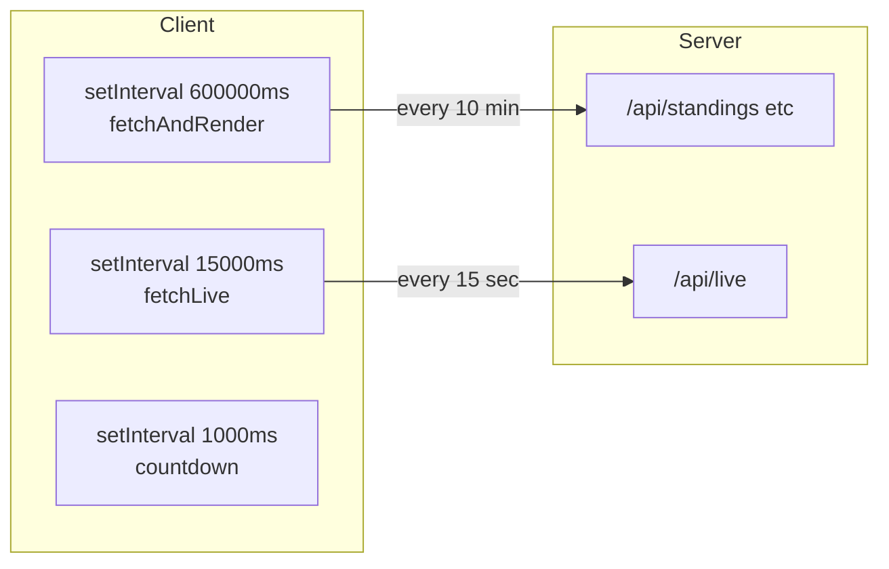

## 8.2 Polling Configuration

| Timer | Interval | Function | Endpoints | Rationale |
|-------|----------|----------|-----------|-----------|
| `__pollTimer` | 600,000 ms (10 min) | `fetchAndRender()` | standings, last-race, qualifying, tire-strategy, weather, driver, history | Standings change only after races; 10-min matches server CACHE_TTL |
| `__liveTimer` | 15,000 ms (15 sec) | `fetchLive()` | /api/live | Matches OpenF1 live cache TTL; sufficient for fan dashboard |
| `__countdownTimer` | 1,000 ms (1 sec) | countdown update | Client-side only | Smooth lights-out countdown |
| Dwell tracker | 5,000 ms (5 sec) | `trackDwell()` | localStorage only | Thanks popup 90s gate |

## 8.3 Live Session Detection

Server-side logic in `api_live()`:
1. Fetch `GET https://api.openf1.org/v1/sessions?year=2026`
2. For each session, parse `date_start` and `date_end` ISO timestamps
3. If `date_start <= now <= date_end`, session is live
4. Fetch position, car_data (last 50 rows for speed), race_control (last 8)
5. Return `live: true` with grid and messages

## 8.4 UI Live State Machine

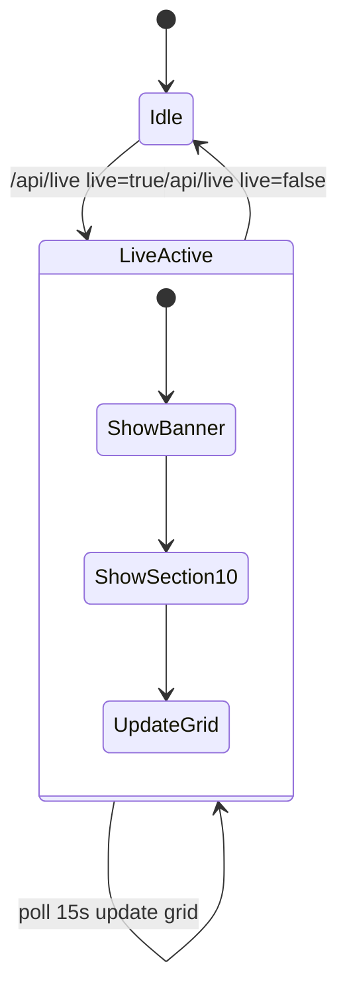

When live:
- `#liveBanner` receives class `show`
- `#liveTiming` section receives class `show`
- Grid rows update with position, gap, speed

When not live:
- Both elements hidden
- Dashboard shows historical data only

---

# 9. User Experience Design

## 9.1 Design Philosophy

The UI replicates the **Formula 1 broadcast pit wall aesthetic**: dark backgrounds, high information density, monospace timing figures, team-colour accents, and the iconic red `#e10600` brand colour. The design prioritizes data legibility over whitespace — every section is a timing screen, not a marketing landing page.

## 9.2 Colour System

### 9.2.1 Core Palette

| Variable | Hex | Usage |
|----------|-----|-------|
| `--f1-black` | #151515 | Page background, hero, on-track SVG |
| `--f1-red` | #e10600 | F1 brand red, ticker border, live banner, pole accent |
| `--f1-white` | #ffffff | High-contrast text on dark |
| `--f1-grey` | #38383f | Circuit outlines, muted SVG strokes |
| `--f1-mid` | #242424 | Card surfaces, countdown cells |
| `--f1-surface` | #1e1e1e | Section panels |
| `--f1-border` | #2e2e2e | Section borders, table dividers |
| `--f1-text` | #f5f5f5 | Primary body text |
| `--f1-text-2` | #888888 | Labels, eyebrows, metadata |
| `--gold` | #d4a017 | P1 leader, user driver highlight, WDC gap |
| `--silver` | #aaaaaa | P2 podium |
| `--bronze` | #8b6343 | P3 podium |
| `--accent` | #e10600 (dynamic) | User team colour after onboarding |

### 9.2.2 Team Colours (2026 Grid)

| Team ID | Hex | Drivers |
|---------|-----|---------|
| `red_bull` | #3671C6 | VER, TSU |
| `mclaren` | #FF8000 | NOR, PIA |
| `ferrari` | #E8002D | LEC, HAM |
| `mercedes` | #27F4D2 | RUS, ANT |
| `aston_martin` | #229971 | ALO, STR |
| `alpine` | #0093CC | GAS, DOO |
| `audi` | #00877C | HUL, BOR |
| `racing_bulls` | #6692FF | LAW, HAD |
| `haas` | #B6BABD | OCO, BEA |
| `williams` | #64C4FF | ALB, SAI |
| `cadillac` | #8A9099 | BOT, PER |

### 9.2.3 Tire Compound Colours

| Compound | Variable | Hex |
|----------|----------|-----|
| SOFT | --soft | #ff7575 |
| MEDIUM | --medium | #ffd84d |
| HARD | --hard | #f0f0f0 |
| INTERMEDIATE | --inter | #4ad07c |
| WET | --wet | #4a8fd0 |

## 9.3 Typography System

| Role | Font Family | Weight | Usage |
|------|-------------|--------|-------|
| Display headlines | Formula1 Display → Barlow Condensed | 900 | Section titles, hero, driver names |
| Body text | Inter | 400–500 | Descriptions, news body |
| Data / timing | JetBrains Mono | 300–700 | All numbers, codes, times, § prefix |

**Rules:**
- Section headlines: uppercase, Formula1 Display
- All timing values: `font-variant-numeric: tabular-nums`
- Section numbers prefixed with `§` in JetBrains Mono
- Structural cards: zero border-radius; badges only `border-radius: 2px`

## 9.4 Animation System

| Keyframe | Duration | Used In |
|----------|----------|---------|
| `maskRevealUp` | 0.5–0.6s | Onboarding headlines, hero |
| `underlineDraw` | 0.8s | Hero red underline |
| `ticker` | 48s linear infinite | Top ticker strip |
| `pulseDot` | 1–1.5s | Live dots, countdown labels |
| `barGrow` | 0.8s | Constructor points bars |
| `rowSlide` | 0.4s staggered | Table row entrance |
| `speedLine` | 6–8s | Hero ambient lines |
| `flagWave` | 2s | Next race flag emoji |
| `flashOut` | 0.6s | Onboarding exit |
| `checkerWipe` | 0.7s | Onboarding checker flag |
| `particleBurst` | 0.6s | Driver card selection |
| `liveBannerPulse` | 1s | Live banner dot |
| `orbDrift` | 12s | Onboarding background orbs |
| `splashLoad` | 1.5s | Loading bar sweep |
| `drvIn` | 0.4s staggered | Driver grid cards |

## 9.5 Layout Structure

```
┌─────────────────────────────────────────────────────────┐
│ TICKER (sticky top)                                     │
├─────────────────────────────────────────────────────────┤
│ LIVE BANNER (conditional, sticky below ticker)          │
├─────────────────────────────────────────────────────────┤
│ HERO — personalized greeting                            │
│ NEXT RACE — countdown + circuit stats                   │
│ CALENDAR — horizontal scroll strip                      │
├──────────────┬──────────────┬──────────────────────────┤
│ §01 Drivers  │ §02 Const.   │ §03 Paddock Intel        │
├──────────────┴──────────────┴──────────────────────────┤
│ §04 Tire Strategy                                       │
│ §05 Qualifying                                          │
│ §06 Telemetry (canvas)                                  │
│ §07 Championship History (canvas)                       │
│ §08 Driver Spotlight                                    │
│ §09 Weather                                             │
│ §10 Live Timing (conditional)                           │
│ Stats Ribbon · On Track SVG · Mini-map · Next 3        │
└─────────────────────────────────────────────────────────┘
│ Chips: Edit Profile (BL) · Install App (TL) · Thanks (BR)│
└─────────────────────────────────────────────────────────┘
```

## 9.6 Responsive Breakpoints

| Breakpoint | Layout Changes |
|------------|----------------|
| >1200px | 3-column main grid, 4-col stats ribbon |
| 960–1200px | 2-column main grid, §03 spans full width |
| 640–960px | Single column, 2-col next-3, 2-col stats |
| <640px | Single column, 2-col driver grid, hide Q1/Q2 in quali |

---

# 10. Security Architecture

## 10.1 Security Model

Pit Wall is a **read-heavy public dashboard** with no user accounts. Security priorities are: safe API exposure, input sanitization on write endpoints, secrets hygiene, and CORS awareness.

## 10.2 Authentication and Authorization

| Concern | Implementation |
|---------|----------------|
| User authentication | None — not required |
| API authentication | None — all endpoints public |
| Admin endpoints | None |
| Role-based access | Not applicable |

## 10.3 Input Validation

| Endpoint | Validation |
|----------|------------|
| POST /api/thanks | message truncated to 280 chars; name defaults to Anonymous |
| GET /api/telemetry/{code} | Code uppercased; invalid codes return 206 with error |
| GET /api/qualifying | round parsed as optional int |
| Frontend rendering | esc() function HTML-escapes all dynamic text |

## 10.4 API Security

| Measure | Status | Production Recommendation |
|---------|--------|-------------------------|
| CORS | allow_origins=* | Restrict to deployed frontend origin |
| Rate limiting | Not implemented | Add slowapi or nginx limits |
| HTTPS | Deployment-dependent | Enforce TLS in production |
| Dependency scanning | Manual | pip-audit in CI |

## 10.5 Secrets Management

No API keys required. FastF1, Jolpica, and OpenF1 are public APIs.
The `.env.example` documents optional host/port configuration.

## 10.6 Client-Side Security

- `esc()` prevents XSS from API data injected via innerHTML templates
- localStorage stores only non-sensitive preferences (name, driver code)
- Service worker scope limited to same origin
- No third-party analytics scripts loaded

## 10.7 Threat Model Summary

| Threat | Likelihood | Mitigation |
|--------|------------|------------|
| XSS via API data | Medium | esc() on all dynamic strings |
| CORS abuse | Low | Public read-only API; no sensitive data |
| DoS on API | Medium | Add rate limiting in production |
| Thanks spam | Medium | Rate limit POST /api/thanks |
| Cache poisoning | Low | Server controls cache keys entirely |

---

# 11. Performance Engineering

## 11.1 Multi-Layer Caching (No Redis)

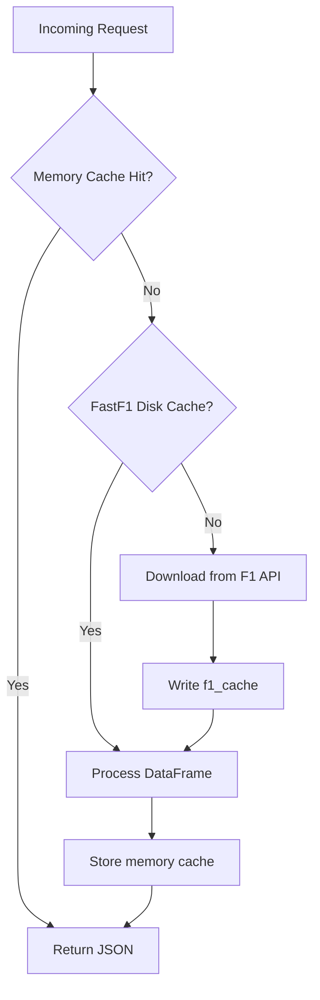

## 11.2 Cache Hit Rate Expectations

| Layer | Expected Hit Rate (steady state) | Notes |
|-------|----------------------------------|-------|
| Memory `_cache` | 85-95% | Aligned with 10-min client poll |
| FastF1 disk | 99%+ after first session load | Persists across restarts |
| Service Worker shell | 100% after first visit | index.html cached |
| Service Worker fonts | 90%+ | stale-while-revalidate |

## 11.3 Expected Performance Metrics

| Operation | Cold (first request) | Warm (cached) |
|-----------|---------------------|---------------|
| GET /api/standings | 15-45 seconds | under 100 ms |
| GET /api/telemetry/NOR | 20-60 seconds | under 200 ms |
| GET /api/live | 1-3 seconds | under 50 ms |
| GET /api/weather | 10-30 seconds | under 100 ms |
| Frontend initial render | 2-5 seconds | 1-2 seconds |
| Canvas telemetry draw | under 16 ms | under 16 ms |

## 11.4 Frontend Optimizations

- **Parallel API fetch:** Promise.all for standings, last-race, qualifying, tire, weather
- **Lazy history chart:** IntersectionObserver defers canvas draw until section visible
- **Telemetry downsample:** Server returns every 5th row — ~80% payload reduction
- **Conditional live section:** Section 10 hidden when not live — zero DOM churn
- **Ticker pause on hover:** animation-play-state: paused reduces GPU work
- **Zero JS bundles:** No npm, no parse/compile of framework code
- **CSS animations:** Compositor-thread keyframes vs JS requestAnimationFrame loops

## 11.5 Backend Optimizations

- **Startup warmup:** Background daemon thread loads last race before first HTTP request
- **Selective session.load:** telemetry=False on race sessions — faster load
- **TTL-aligned polling:** Client 10-min poll matches server 600s CACHE_TTL
- **OpenF1 car_data slice:** Only last 50 car_data entries used for speed map
- **Championship history cache:** 30-min TTL — expensive multi-round Jolpica loop
- **Exception swallowing:** try/except on all external calls — never 500 on data miss

## 11.6 What We Do NOT Use

| Technique | Why Not Applicable |
|-----------|-------------------|
| Redis | Python dict sufficient at current scale |
| SSR / ISR | Static HTML; all dynamics client-side |
| Code splitting | Single file — no chunks |
| Image optimization CDN | Minimal images; emoji flags |
| React memoization | No React |

---

# 12. Scalability Plan

## 12.1 Current Bottlenecks

| Bottleneck | Impact |
|------------|--------|
| FastF1 session.load CPU/IO | Slow cold requests |
| Single-process _cache | Cache miss per worker |
| Synchronous requests in async handlers | Thread pool saturation |
| No CDN for API | Global latency to origin |

## 12.2 Scaling to 1,000 concurrent users

**Architecture:** Single uvicorn + CDN for index.html

**Notes:** Memory cache handles ~6 API calls/user/hour. f1_cache on local SSD.

## 12.3 Scaling to 10,000 users

**Architecture:** 2-4 uvicorn workers behind nginx load balancer

**Notes:** Replace _cache with Redis. Mount shared f1_cache on NFS/EFS. Restrict CORS.

## 12.4 Scaling to 100,000 users

**Architecture:** Kubernetes: 10+ API pods, Redis cluster, CloudFront

**Notes:** Post-race batch job pre-warms all sessions. Edge cache /api/standings 5 min SWR.

## 12.5 Scaling to 1,000,000 users

**Architecture:** Dedicated timing microservice, global CDN, batch ETL pipeline

**Notes:** WebSocket fanout for /api/live only. Standings served from edge. FastF1 moved to offline pipeline.

## 12.6 Database Scaling

Not applicable — no database. If user accounts are added in future, PostgreSQL with read replicas documented as Phase 2.

## 12.7 CDN Strategy

| Asset | CDN Treatment |
|-------|---------------|
| index.html | Edge cached, short TTL or versioned |
| sw.js | Must revalidate on deploy — cache bust via version in CACHE_SHELL name |
| manifest.webmanifest | Long TTL |
| /api/* | Do not CDN-cache live; standings may use 5-min SWR at edge |

---

# 13. Deployment Guide

## 13.1 Local Development

```bash
cd f1-dashboard
python -m venv .venv && source .venv/bin/activate
pip install -r requirements.txt
uvicorn server:app --reload --port 8000
# Separate terminal:
python -m http.server 3000
# Browser: http://localhost:3000/index.html
```

## 13.2 Staging Deployment

1. Deploy API to staging host (e.g. `staging-api.pitwall.example`)
2. Upload `index.html` with `<meta name="api-base" content="https://staging-api...">`
3. Mount persistent volume for `f1_cache`
4. Run smoke test: `curl staging-api/api/standings`
5. Verify PWA manifest and icons resolve over HTTPS

## 13.3 Production Deployment

| Component | Recommendation |
|-----------|----------------|
| API server | Railway, Render, Fly.io, AWS ECS, GCP Cloud Run |
| Frontend | S3 + CloudFront, Netlify, or Vercel static |
| f1_cache | **Required** persistent volume — 5+ GB recommended |
| TLS | Let's Encrypt or cloud provider certificate |
| Process manager | uvicorn with `--workers 2` behind nginx |

## 13.4 Environment Variables

| Variable | Default | Description |
|----------|---------|-------------|
| YEAR | 2026 (hardcoded) | F1 season year |
| CACHE_TTL | 600 | Default memory cache seconds |
| API_HOST | 0.0.0.0 | Uvicorn bind address |
| API_PORT | 8000 | Uvicorn port |

## 13.5 Frontend API Configuration

```html
<meta name="api-base" content="https://api.your-domain.com">
```

When `api-base` is empty and hostname is not localhost, `API_BASE` resolves to `''` (same-origin). Configure reverse proxy `/api` → uvicorn for same-origin production.

## 13.6 Docker

```dockerfile
FROM python:3.12-slim
WORKDIR /app
COPY requirements.txt server.py ./
RUN pip install --no-cache-dir -r requirements.txt
RUN mkdir -p /app/f1_cache
VOLUME /app/f1_cache
EXPOSE 8000
CMD ["uvicorn", "server:app", "--host", "0.0.0.0", "--port", "8000"]
```

## 13.7 nginx Reverse Proxy Example

```nginx
server {
    listen 443 ssl;
    server_name pitwall.example;
    location /api/ {
        proxy_pass http://127.0.0.1:8000;
        proxy_read_timeout 120s;
    }
    location / {
        root /var/www/pitwall;
        try_files $uri /index.html;
    }
}
```

## 13.8 CI/CD Workflow

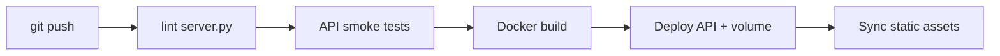

## 13.9 Monitoring Stack

| Tool | Purpose |
|------|---------|
| Uvicorn access logs | Request count and latency |
| Sentry | Python and JS exception tracking |
| Uptime Robot | Poll /api/standings every 5 min |
| Prometheus | Custom metrics: cache_hit, fallback_count |
| Disk alerts | f1_cache directory size threshold |

---

# 14. Business Value

## 14.1 Market Opportunity

Formula 1's global audience continues to grow, with strong adoption among 18-34 digital-native viewers. These fans expect interactive, personalized experiences beyond linear broadcast. Pit Wall addresses the gap between official apps (subscription, limited analytics) and raw data tools (FastF1 notebooks, inaccessible to casual fans).

## 14.2 Monetization Opportunities

| Model | Description | Feasibility |
|-------|-------------|-------------|
| Freemium | Free dashboard; premium telemetry, multi-season history | High |
| Team white-label | Custom Pit Wall for team fan zones | Medium |
| Sponsorship | Weather by partner, tire strategy presented by tire brand | High |
| Tips | Ko-fi / UPI in thanks popup | Implemented |
| API tier | Paid access for creators and fantasy leagues | Medium |

## 14.3 Premium Feature Roadmap

- Push notifications for lights out (PWA Notification API)
- Multi-season championship comparison
- Fantasy league integration
- AI-generated race summaries
- Pit stop loss analysis from lap data
- Custom dashboard layout persistence (cloud sync)
- Social: compare Pit Walls with friends

## 14.4 Growth Loops

1. **Share card virality** — 1080×1080 PNG with URL attribution
2. **PWA install** — home screen icon drives return visits
3. **Driver personalization** — fans share when their driver is highlighted
4. **Live timing** — race-day Twitter/Discord link sharing

---

# 15. Feature Walkthrough

Complete documentation of every dashboard feature.

## 15.1 Onboarding Overlay

**Dashboard Section:** § Onboarding
**Purpose:** Capture name and favourite driver
**User Flow:** Open app → enter name → pick driver → checker exit → dashboard
**Technical Implementation:** initOnboarding, saveConfig, applyTheme, particleBurst animation
**Business Value:** Personalization increases session depth and return rate

## 15.2 Loading Splash

**Dashboard Section:** Splash
**Purpose:** Brand moment during API fetch
**User Flow:** Auto-shown until fetchAndRender completes or 4s max
**Technical Implementation:** hideSplash, splashLoad keyframe
**Business Value:** Perceived performance and F1 identity

## 15.3 Top Ticker Strip

**Dashboard Section:** Ticker
**Purpose:** Broadcast rolling headline
**User Flow:** Always visible sticky; pauses on hover
**Technical Implementation:** renderTicker, 48s ticker animation, doubled content
**Business Value:** Championship context at a glance

## 15.4 Live Banner

**Dashboard Section:** Live Banner
**Purpose:** Session-active alert
**User Flow:** Shows when live:true from OpenF1
**Technical Implementation:** renderLiveBanner, 15s fetchLive poll
**Business Value:** Drives attention to live timing on race day

## 15.5 Hero Section

**Dashboard Section:** Hero
**Purpose:** Personalized welcome headline
**User Flow:** [Name]'s PIT WALL with animated reveal
**Technical Implementation:** paintHeader, maskRevealUp
**Business Value:** Emotional product ownership

## 15.6 Next Race Block

**Dashboard Section:** Next Race
**Purpose:** Upcoming GP focus
**User Flow:** Countdown DD/HH/MM/SS + circuit stats
**Technical Implementation:** renderNextRace, CIRCUIT_META, setupCountdowns
**Business Value:** Race weekend anticipation

## 15.7 Season Calendar

**Dashboard Section:** Calendar
**Purpose:** Full season horizontal strip
**User Flow:** Click done race reloads paddock and qualifying
**Technical Implementation:** renderCalendar, __selectedRound
**Business Value:** Interactive season exploration

## 15.8 Section 01 Drivers Championship

**Dashboard Section:** §01
**Purpose:** Top 10 WDC table
**User Flow:** User driver gold highlight; leader gold gradient
**Technical Implementation:** renderDrivers, Jolpica standings
**Business Value:** Primary championship tracking

## 15.9 Section 02 Constructors Cup

**Dashboard Section:** §02
**Purpose:** WCC with points bars
**User Flow:** Animated bar width = pct of leader
**Technical Implementation:** renderConstructors, TEAM_HERITAGE
**Business Value:** Constructor rivalry narrative

## 15.10 Section 03 Paddock Intel

**Dashboard Section:** §03
**Purpose:** Last race analysis hub
**User Flow:** Podium, results, SC timeline, RC log, news
**Technical Implementation:** renderPaddock, renderNews, extract_* API
**Business Value:** Post-race storytelling

## 15.11 Section 04 Tire Strategy

**Dashboard Section:** §04
**Purpose:** Stint visualization
**User Flow:** Top 10 compound bars proportional to laps
**Technical Implementation:** renderTireStrategy, api_tire_strategy
**Business Value:** Strategy depth for expert fans

## 15.12 Section 05 Qualifying Recap

**Dashboard Section:** §05
**Purpose:** Full qualifying grid
**User Flow:** Q1/Q2 elim shading; pole red border
**Technical Implementation:** renderQualifying, api_qualifying
**Business Value:** Grid context pre-race

## 15.13 Section 06 Telemetry Viewer

**Dashboard Section:** §06
**Purpose:** Canvas telemetry analysis
**User Flow:** Speed trace, circuit map, optional compare
**Technical Implementation:** drawSpeedCanvas, drawMapCanvas, api_telemetry
**Business Value:** Key technical differentiator

## 15.14 Section 07 Championship History

**Dashboard Section:** §07
**Purpose:** Points progression chart
**User Flow:** Top 5 animated line draw on scroll
**Technical Implementation:** renderHistoryChart, IntersectionObserver
**Business Value:** Season narrative visualization

## 15.15 Section 08 Driver Spotlight

**Dashboard Section:** §08
**Purpose:** User driver profile
**User Flow:** Season/career stats, last 5 pills, share
**Technical Implementation:** renderSpotlight, api_driver, drawShareCard
**Business Value:** Fan identity centerpiece

## 15.16 Section 09 Weather

**Dashboard Section:** §09
**Purpose:** Track conditions
**User Flow:** Temp, humidity, wind arrow, rainfall
**Technical Implementation:** renderWeather, api_weather
**Business Value:** Strategy and narrative context

## 15.17 Section 10 Live Timing

**Dashboard Section:** §10
**Purpose:** Real-time OpenF1 grid
**User Flow:** Only visible during active sessions
**Technical Implementation:** renderLiveTiming, fetchLive 15s
**Business Value:** Race-day killer feature

## 15.18 Stats Ribbon

**Dashboard Section:** Stats
**Purpose:** Four headline metrics
**User Flow:** Lead, FL, winner, your driver
**Technical Implementation:** renderStatsRibbon
**Business Value:** At-a-glance race week summary

## 15.19 On Track SVG

**Dashboard Section:** On Track
**Purpose:** Animated cars on circuit path
**User Flow:** 20 cars team-coloured; user gold outline
**Technical Implementation:** renderOnTrack, TRACK_SHAPES, animateMotion
**Business Value:** Visual delight and broadcast feel

## 15.20 Circuit Mini-Map

**Dashboard Section:** Mini-map
**Purpose:** Next race circuit SVG
**User Flow:** Silhouette + DRS zones + turn labels
**Technical Implementation:** renderMinimap, CIRCUIT_PATHS
**Business Value:** Circuit familiarity

## 15.21 Next 3 Races

**Dashboard Section:** Next 3
**Purpose:** Upcoming race cards
**User Flow:** Live countdown per card
**Technical Implementation:** renderNext3
**Business Value:** Forward-looking calendar

## 15.22 Share Card

**Dashboard Section:** Share
**Purpose:** 1080x1080 social PNG
**User Flow:** Canvas render → share or download
**Technical Implementation:** drawShareCard, navigator.share
**Business Value:** Viral acquisition

## 15.23 PWA Install

**Dashboard Section:** PWA
**Purpose:** Add to home screen
**User Flow:** Install chip + iOS tooltip
**Technical Implementation:** sw.js, manifest, beforeinstallprompt
**Business Value:** Retention and re-engagement

## 15.24 Thanks Popup

**Dashboard Section:** Thanks
**Purpose:** Creator support gate
**User Flow:** 90s dwell; POST thanks or tip
**Technical Implementation:** trackDwell, api_thanks
**Business Value:** Community and monetization

## 15.25 Edit Profile Chip

**Dashboard Section:** Edit
**Purpose:** Re-run onboarding
**User Flow:** Prefilled; re-theme on save
**Technical Implementation:** editChip click handler
**Business Value:** Low-friction preference update

---

# 16. Onboarding Guide for Developers

## 16.1 Prerequisites
- Python 3.10+
- pip and optional venv
- Chrome/Firefox/Safari/Edge (latest)
- Network access to FastF1, Jolpica, OpenF1 endpoints

## 16.2 Clone and Install
```bash
cd f1-dashboard
python -m venv .venv
source .venv/bin/activate  # Windows: .venv\Scripts\activate
pip install -r requirements.txt
```

## 16.3 Run Development Servers
```bash
# Terminal 1 — API
uvicorn server:app --reload --host 0.0.0.0 --port 8000
# Terminal 2 — Frontend
python -m http.server 3000
```
Open `http://localhost:3000/index.html`. Complete onboarding on first visit.

## 16.4 Debugging Guide

| Symptom | Likely Cause | Fix |
|---------|--------------|-----|
| CORS error in console | Opening file:// directly | Use http.server on :3000 |
| API connection refused | uvicorn not running | Start server on :8000 |
| 30+ second first load | FastF1 cold cache | Normal; wait or check f1_cache |
| Empty standings | Jolpica down | fallback_standings should activate |
| live:false always | No active session | Expected between weekends |
| Telemetry 206 error | Qualifying not cached | Trigger /api/qualifying first |
| Fonts wrong | CDN blocked | Check network; SW font cache |

## 16.5 Adding a New API Endpoint
1. Define async handler in `server.py`
2. Apply `@cached('key', ttl)` decorator
3. Wrap FastF1/external calls in try/except
4. Return `JSONResponse(..., status_code=206)` on partial failure
5. Document in README and this file
6. Add `apiFetch('/api/new')` in index.html

## 16.6 Adding a New UI Section
1. Add `<section class="section">` with `section-num` and `section-title`
2. Add CSS rules matching existing section patterns
3. Implement `renderNewSection(data, cfg)` function
4. Call from `renderAll()`
5. Include in `fetchAndRender` parallel fetch if new API needed

## 16.7 Testing Checklist
- [ ] Onboarding saves and restores from localStorage
- [ ] All §01-§10 sections render with live API
- [ ] Calendar click updates paddock for historical round
- [ ] Telemetry driver switch redraws canvases
- [ ] Live section toggles when session active (or mock)
- [ ] Share card downloads or native shares
- [ ] PWA installs on HTTPS deployment
- [ ] Service worker serves shell offline

## 16.8 Production Deploy Checklist
- [ ] Persistent f1_cache volume attached
- [ ] meta api-base points to production API
- [ ] HTTPS enabled
- [ ] CORS restricted to frontend origin
- [ ] icon-192.png and icon-512.png deployed
- [ ] f1_cache in .gitignore

---

# 17. Maintenance Guide

## 17.1 Troubleshooting

### Disk full / f1_cache huge
**Resolution:** FastF1 accumulates session files. Delete f1_cache contents or expand volume.

### Stale data after race
**Resolution:** Memory cache TTL is 10 min. Restart uvicorn to clear _cache immediately.

### HTTP 206 on all endpoints
**Resolution:** FastF1 and Jolpica both failing. Check network; verify YEAR=2026 data exists.

### Wrong driver roster
**Resolution:** Update DRIVERS_2026 in server.py AND index.html (must match).

### OpenF1 live empty
**Resolution:** Session may not be in OpenF1 yet; check api.openf1.org manually.

### Thanks messages lost
**Resolution:** _thanks_log is in-memory only — expected on restart.

### Canvas blank on telemetry
**Resolution:** Qualifying session unavailable; check /api/telemetry/NOR in curl.

## 17.2 Season Rollover
1. Update `YEAR = 2026` → new year in server.py
2. Refresh DRIVERS_2026, TEAM_COLORS, CIRCUIT_META in both files
3. Clear f1_cache directory
4. Clear browser localStorage for testing
5. Update manifest `name` if needed

## 17.3 Recommended Logging Additions
```python
import logging
logger = logging.getLogger('pitwall')
# Log cache hits: logger.debug('cache hit: %s', key)
# Log fallbacks: logger.warning('fallback standings activated')
```

## 17.4 Health Check Endpoint (Suggested)
```python
@app.get('/api/health')
async def health():
    return {'ok': True, 'cache_keys': len(_cache), 'year': YEAR}
```

---

# 18. Executive Summary

## 18.1 Elevator Pitch

**F1 Pit Wall 2026** is a personalized, broadcast-quality Formula 1 dashboard that combines FastF1 session telemetry, Jolpica championship data, and OpenF1 live timing in a zero-build-step web application installable as a PWA. Fans onboard with their name and favourite driver, receiving a team-themed pit wall with standings, tire strategy, telemetry traces, and live timing — deployable with two terminal commands.

## 18.2 For Formula 1 Management

Demonstrates premium fan engagement potential using publicly available timing ecosystems. The broadcast aesthetic aligns with F1 brand guidelines. Architecture could inform official fan zone kiosks or companion app prototypes.

## 18.3 For Investors

Lean stack minimizes infrastructure cost: no database, no Node build farm, static frontend on CDN. Clear monetization via freemium, sponsorship, and tips. Share card creates viral loop.

## 18.4 For Hackathon Judges

| Criterion | Evidence |
|-----------|----------|
| Technical depth | FastF1 telemetry pipeline, Canvas rendering, dual polling |
| Completeness | 11 API endpoints, 25 UI features, PWA, onboarding |
| UX polish | 20+ CSS animations, F1 typography, team theming |
| Resilience | Triple fallback: FastF1 → Jolpica → hardcoded roster |
| Deployability | pip install + uvicorn + open HTML |

## 18.5 Technical Exceptionalism

The platform stands out because it makes correct architectural tradeoffs:
- **FastF1** where depth matters (stints, telemetry, weather)
- **Vanilla JS** where deployability matters (single file, no npm)
- **Polling** where simplicity matters (15s live is sufficient for fans)
- **No database** where data is external (no sync problems)
- **PWA** where retention matters (installable, offline shell)

This is not a standings table in React. It is a pit wall.

---

# Appendix A: Glossary

- **WDC:** World Drivers' Championship
- **WCC:** World Constructors' Championship
- **FP1/FP2/FP3:** Free Practice sessions
- **SC:** Safety Car physical deployment on track
- **VSC:** Virtual Safety Car — delta time limit
- **DRS:** Drag Reduction System — overtaking aid
- **TTL:** Time To Live — cache expiration duration
- **PWA:** Progressive Web App — installable web application
- **ASGI:** Asynchronous Server Gateway Interface
- **Ergast:** Historical F1 API (deprecated; Jolpica mirrors it)
- **Jolpica:** Maintained Ergast-compatible API at api.jolpi.ca
- **OpenF1:** Open-source live timing API at api.openf1.org
- **Stint:** Consecutive laps on one tire compound
- **Pole:** P1 on starting grid from qualifying
- **DNF:** Did Not Finish
- **Compound:** Tire type: SOFT, MEDIUM, HARD, INTER, WET

---

# Appendix B: Complete API Response Schemas

## B.1 Driver Standing Object
```json
{"pos":1,"code":"NOR","given_name":"Lando","family_name":"Norris",
"team_id":"mclaren","team_name":"McLaren","pts":125,"wins":2,"gap":0}
```

## B.2 Telemetry Sector Point
```json
{"x":0.45,"y":0.72,"color":"#00d2be"}
```

## B.3 Live Grid Row
```json
{"pos":1,"driver_code":"VER","team_color":"#3671C6","speed":312,"gap_to_leader":""}
```

---

# Appendix C: TEAM_COLORS Reference

| team_id | Hex | Aliases |
|---------|-----|---------|
| mercedes | #27F4D2 | — |
| ferrari | #E8002D | — |
| mclaren | #FF8000 | — |
| red_bull | #3671C6 | redbull, red_bull |
| williams | #64C4FF | — |
| haas | #B6BABD | — |
| alpine | #0093CC | — |
| audi | #00877C | — |
| racing_bulls | #6692FF | racingbulls, rb |
| aston_martin | #229971 | aston |
| cadillac | #8A9099 | — |

---

# Appendix D: localStorage Key Reference

| Key | Schema | Written By | Read By |
|-----|--------|------------|---------|
| f1-dashboard:v1 | {name, driverCode, teamId, savedAt} | saveConfig | loadConfig, boot |
| f1-dwell | number (seconds) | trackDwell interval | trackDwell |
| f1-thanks-dismiss | unix ms timestamp | thanksSkip click | trackDwell |
| f1-tipped | '1' | thanksSend success | trackDwell |

---

# Appendix E: Service Worker Event Reference

| Event | Handler | Action |
|-------|---------|--------|
| install | cache.addAll SHELL_URLS | Precache index.html; skipWaiting |
| activate | caches.delete old versions | clients.claim |
| fetch /api/* | networkFirst | Always try network; no long API cache |
| fetch fonts | staleWhileRevalidate | Fast font load, background update |
| fetch static | cacheFirst | Scripts, styles, images |
| fetch default | networkFirst shell | HTML shell offline fallback |

---

# Appendix F: CIRCUIT_META Reference (2026 Calendar)

Hardcoded circuit metadata in index.html for next-race stats display.

| circuit_id | City | Laps | Length km | Lap Record | Record Holder |
|------------|------|------|-----------|------------|---------------|
| bahrain | Sakhir | 57 | 5.412 | 1:31.447 | Pedro de la Rosa |
| jeddah | Jeddah | 50 | 6.174 | 1:27.293 | Lewis Hamilton |
| melbourne | Melbourne | 58 | 5.278 | 1:19.813 | Charles Leclerc |
| suzuka | Suzuka | 53 | 5.807 | 1:30.983 | Lewis Hamilton |
| shanghai | Shanghai | 56 | 5.451 | 1:32.238 | Michael Schumacher |
| miami | Miami | 57 | 5.412 | 1:29.708 | Max Verstappen |
| imola | Imola | 63 | 4.909 | 1:15.484 | Lewis Hamilton |
| monaco | Monaco | 78 | 3.337 | 1:12.909 | Lewis Hamilton |
| montreal | Montreal | 70 | 4.361 | 1:13.078 | Valtteri Bottas |
| barcelona | Barcelona | 66 | 4.675 | 1:16.330 | Max Verstappen |
| spielberg | Spielberg | 71 | 4.318 | 1:05.619 | Carlos Sainz |
| silverstone | Silverstone | 52 | 5.891 | 1:27.097 | Max Verstappen |
| spa | Spa | 44 | 7.004 | 1:46.286 | Lewis Hamilton |
| hungaroring | Hungaroring | 70 | 4.381 | 1:16.627 | Lewis Hamilton |
| zandvoort | Zandvoort | 72 | 4.259 | 1:11.097 | Lewis Hamilton |
| monza | Monza | 53 | 5.793 | 1:21.046 | Rubens Barrichello |
| baku | Baku | 51 | 6.003 | 1:43.009 | Charles Leclerc |
| marina_bay | Marina Bay | 62 | 4.94 | 1:35.867 | George Russell |
| cota | COTA | 56 | 5.513 | 1:36.169 | Charles Leclerc |
| mexico_city | Mexico City | 71 | 4.304 | 1:17.774 | Valtteri Bottas |
| interlagos | Interlagos | 71 | 4.309 | 1:10.540 | Valtteri Bottas |
| las_vegas | Las Vegas | 50 | 6.12 | 1:35.490 | Charles Leclerc |

---

# Appendix G: Decision Log

| 2026-03 | FastAPI + FastF1 | Native Python F1 data access |
| 2026-03 | Single index.html | Zero build step deployability |
| 2026-03 | Polling not WebSockets | Simpler ops; 15s adequate |
| 2026-03 | No PostgreSQL | External APIs are source of truth |
| 2026-03 | In-memory cache | No Redis for demo scale |
| 2026-03 | Canvas not Recharts | F1 telemetry aesthetics |
| 2026-06 | Jolpica API | Ergast deprecation workaround |
| 2026-06 | Hardcoded DRIVERS_2026 | Fallback when APIs unavailable |
| 2026-06 | HTTP 206 partial | Graceful degradation signal to client |

---

# Appendix H: index.html DOM ID Reference

| Element ID | Purpose |
|------------|---------|
| `onboarding` | Full-screen onboarding overlay |
| `obStep1 / obStep2` | Onboarding step containers |
| `obName` | Name input field |
| `driverGrid` | Driver picker grid |
| `splash` | Loading splash screen |
| `ticker` | Top ticker track |
| `liveBanner` | Sticky live session banner |
| `dashboard` | Main dashboard container |
| `hero` | Hero section |
| `nextRace` | Next race block |
| `countdown` | Lights out countdown grid |
| `calStrip` | Calendar horizontal strip |
| `driversBody` | Section 01 table body |
| `constructorsBody` | Section 02 table body |
| `paddockBody` | Section 03 content |
| `tireBody` | Section 04 stint bars |
| `qualiBody` | Section 05 qualifying grid |
| `telSpeed / telMap / telDelta` | Telemetry canvases |
| `historyChart` | Section 07 canvas |
| `spotlightBody` | Section 08 driver profile |
| `weatherGrid` | Section 09 weather cards |
| `liveTiming / liveGrid` | Section 10 live timing |
| `statsRibbon` | Four stat cards |
| `ontrackSvg` | Animated cars SVG |
| `minimapSvg` | Circuit mini-map SVG |
| `next3Grid` | Next 3 races cards |
| `shareCanvas` | Offscreen share image canvas |
| `editChip` | Edit profile floating chip |
| `installChip` | PWA install chip |
| `thanksPopup` | Creator thanks popup |

---

# Appendix I: server.py Constants Reference

| Constant | Value | Purpose |
|----------|-------|---------|
| JOLPICA | https://api.jolpi.ca/ergast/f1 | Ergast-compatible REST base |
| OPENF1 | https://api.openf1.org/v1 | Live timing REST base |
| YEAR | 2026 | Season filter |
| CACHE_TTL | 600 | Default memory cache seconds |
| TEAM_COLORS | dict (11 teams) | Server-side colour lookup |
| DRIVERS_2026 | list (22 drivers) | Fallback roster |

---

# Appendix J: Polling Timer Reference

| Variable | Interval | Function | Cleared On |
|----------|----------|----------|------------|
| __pollTimer | 600000 ms | fetchAndRender | Page unload (not explicit) |
| __liveTimer | 15000 ms | fetchLive | Page unload |
| __countdownTimer | 1000 ms | countdown update | Replaced in setupCountdowns |
| Dwell interval | 5000 ms | trackDwell | Never cleared |

---

*End of Architecture Document — F1 Pit Wall 2026*

*Document generated to accompany the f1-dashboard source repository.*
*Stack: Python FastAPI · FastF1 · Jolpica · OpenF1 · Vanilla HTML/CSS/JS · PWA*
