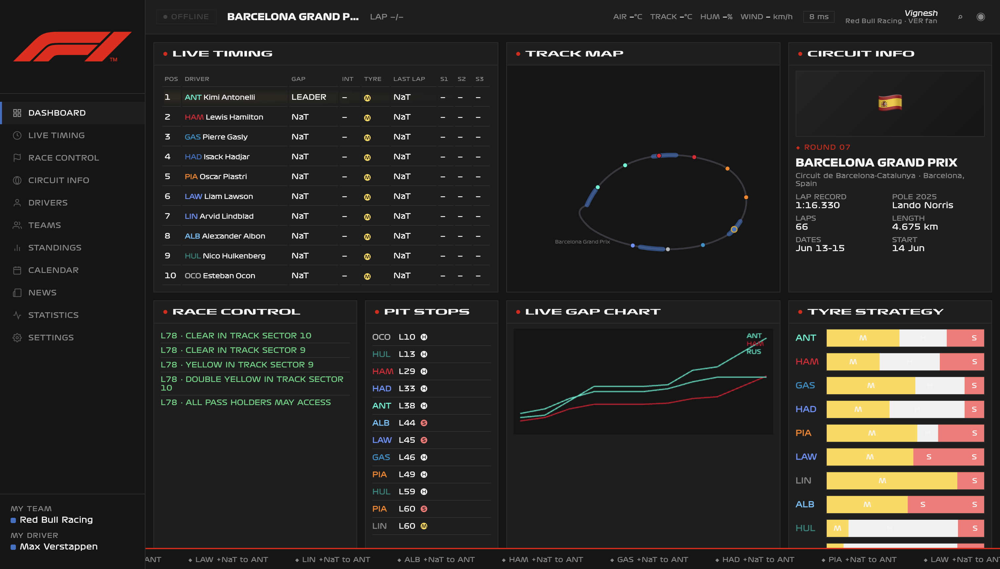
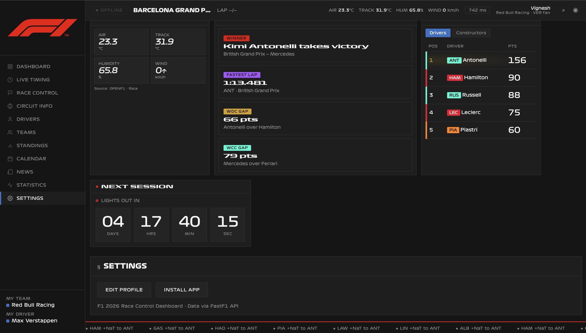
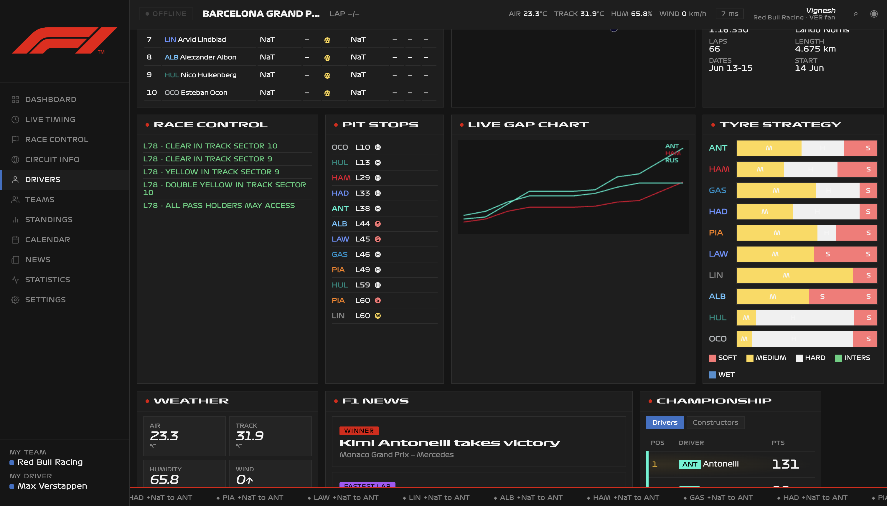
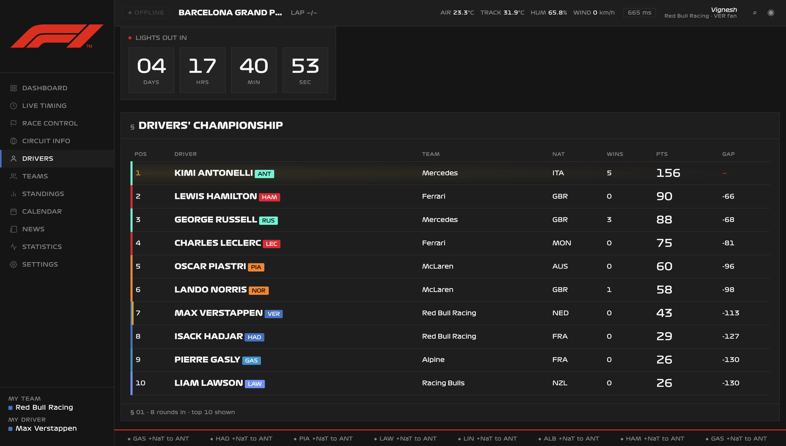
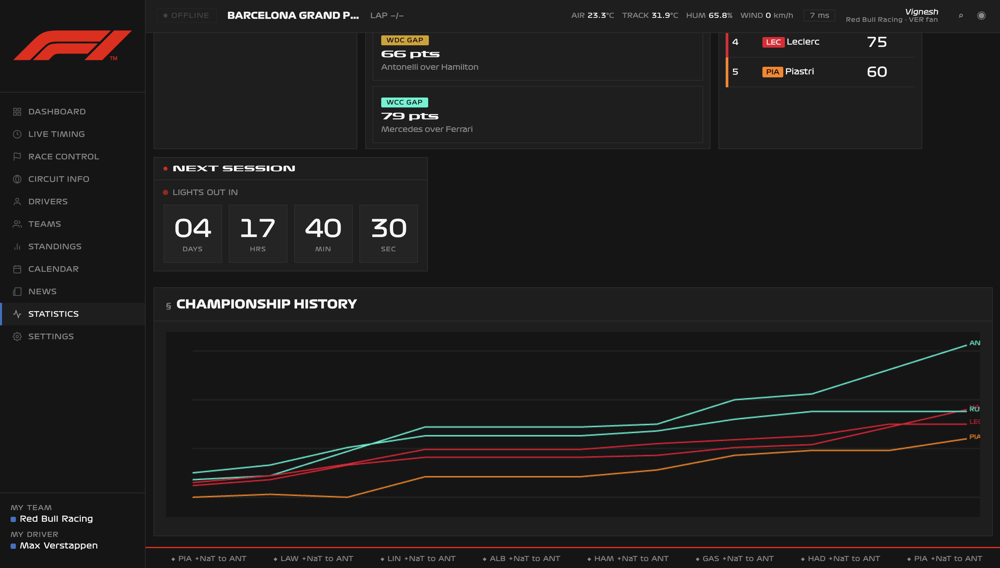

# F1 Pit Wall 2026

**A broadcast-quality, personalized Formula 1 fan dashboard for the 2026 season.**

F1 Pit Wall combines the analytical depth of a professional pit wall with the accessibility of a zero-install web app. Championship standings, live timing, tire strategy, telemetry traces, race control messages, and weather — all in one dark, data-dense interface themed to your favourite driver and team.

No account required. No npm install. No React build step. Run with Docker (`docker compose up`) or two terminal commands and a browser.

<p align="center">
  <video src="assets/dashboard-demo.mp4" controls width="100%" poster="assets/dashboard-main.png">
    Your browser does not support embedded video. <a href="assets/dashboard-demo.mp4">Download the demo</a>.
  </video>
</p>

<p align="center"><em>30-second walkthrough — sidebar navigation, live widgets, championship panels, and the full pit-wall experience.</em></p>

<p align="center">
  
</p>

<p align="center"><em>Main dashboard during the Barcelona Grand Prix — live timing, track map, race control, and strategy widgets in a single pit-wall view.</em></p>

---

## Table of Contents

- [Features](#features)
- [Screenshots & UI Overview](#screenshots--ui-overview)
  - [Demo Video](#demo-video)
- [Architecture](#architecture)
- [Technology Stack](#technology-stack)
- [Data Sources](#data-sources)
- [Quick Start](#quick-start)
  - [Quick Start with Docker](#quick-start-with-docker)
- [Configuration](#configuration)
- [API Reference](#api-reference)
- [Caching & Performance](#caching--performance)
- [Progressive Web App (PWA)](#progressive-web-app-pwa)
- [Project Structure](#project-structure)
- [Deployment](#deployment)
- [Troubleshooting](#troubleshooting)
- [Season Rollover](#season-rollover)
- [Further Reading](#further-reading)
- [License & Acknowledgements](#license--acknowledgements)

---

## Features

### Personalization

| Feature | Description |
|---------|-------------|
| **Onboarding** | Two-step flow: enter your name → pick your favourite driver from the full 2026 grid |
| **Team theming** | The entire UI accents to your driver's constructor colour (`--accent` CSS variable) |
| **Driver spotlight** | Dedicated profile section with season stats, career totals, last 5 results, and a shareable card |
| **Sidebar identity** | Persistent "My Team" / "My Driver" display in the navigation rail |
| **Edit profile** | Re-run onboarding anytime from Settings without losing your session |

Preferences are stored in browser `localStorage` under the key `f1-dashboard:v1`. No server-side user database.

<p align="center">
  
</p>

<p align="center"><em>Personalized for your team and driver — sidebar shows My Team / My Driver, topbar displays your fan profile, and Settings lets you edit or install the PWA.</em></p>

### Dashboard Widgets (Main Grid)

| Widget | Data Source | Description |
|--------|-------------|-------------|
| **Live Timing** | OpenF1 | Real-time position grid with gap, intervals, tyre compound, sector times |
| **Track Map** | Sportmonks CDN / API | Circuit layout image with live car position overlay |
| **Circuit Info** | FastF1 schedule + hardcoded metadata | Next race round, circuit stats, lap record, length, lap count |
| **Race Control** | FastF1 + OpenF1 | Flag-coloured message log (GREEN / YELLOW / RED / ORANGE) |
| **Pit Stops** | FastF1 | Pit stop summary from last race session |
| **Live Gap Chart** | OpenF1 | Canvas chart of gaps to leader during active sessions |
| **Tyre Strategy** | FastF1 | Compound stint bars for top finishers (SOFT / MEDIUM / HARD / INTER / WET) |
| **Weather** | FastF1 | Air temp, track temp, humidity, wind speed & direction, rainfall |
| **F1 News** | Race control + session data | Auto-generated news items from race events |
| **Championship** | Jolpica / Ergast | Tabbed Drivers / Constructors standings widget |
| **Next Session** | FastF1 schedule | Live countdown (DD : HH : MM : SS) to lights out |

<p align="center">
  
</p>

<p align="center"><em>Race weekend view — weather conditions, auto-generated F1 news, championship snapshot, tyre strategy bars, pit stop log, and live gap chart.</em></p>

### Deep-Dive Panels (Sidebar Navigation)

| Panel | Description |
|-------|-------------|
| **Drivers' Championship** | Full WDC table with team colours, points, wins, gaps; your driver highlighted in gold |
| **Constructors' Cup** | WCC table with animated points bars proportional to the leader |
| **Season Calendar** | Horizontal scrollable 24-race calendar; click completed rounds to reload paddock/quali data |
| **Championship History** | Animated Canvas line chart — points progression for top 5 drivers across the season |
| **Telemetry Viewer** | Speed / throttle / brake / DRS trace + speed-coloured circuit mini-map; optional head-to-head compare |
| **Paddock Intel** | Podium, full results, safety car timeline, race control log, session news |
| **Qualifying Recap** | Full Q1/Q2/Q3 grid with elimination shading and pole position highlight |
| **Driver Spotlight** | Your driver's season & career profile with 1080×1080 share card generation |
| **Full Live Timing** | Expanded live grid + race control feed (visible during active sessions) |
| **Settings** | Edit profile, install PWA, version info |

<p align="center">
  
</p>

<p align="center"><em>Drivers' Championship panel — full WDC table with team-colour accents, wins, points, gaps, and a live lights-out countdown.</em></p>

<p align="center">
  
</p>

<p align="center"><em>Statistics panel — WDC/WCC gap summary and an animated Canvas championship history chart tracking points across every round.</em></p>

### Real-Time & Live Session Support

- **15-second polling** of `/api/live` during race weekends
- **Live banner** and topbar badge when an OpenF1 session is active
- **Sticky topbar** shows session name, lap counter, weather, and API latency
- **Footer ticker** with infinite-scroll championship headlines (pauses on hover)

### Progressive Web App

- Installable to home screen (Android / desktop Chrome)
- Service worker caches app shell, fonts, and static assets for offline resilience
- `manifest.webmanifest` with F1 brand colours (`#151515` background, `#e10600` theme)

### Resilience & Fallbacks

The backend uses a **triple-fallback chain** so the dashboard never goes fully blank:

1. **FastF1** — primary source for session-level data (laps, stints, telemetry, weather)
2. **Jolpica / Ergast** — championship standings and career history (with dual base URL failover)
3. **Hardcoded `DRIVERS_2026` roster** — synthetic standings when all APIs are unavailable

Partial failures return **HTTP 206** with `"fallback": true` so the frontend can degrade gracefully.

---

## Screenshots & UI Overview

The UI replicates the **Formula 1 broadcast pit wall aesthetic**:

- Dark `#151515` background with high information density
- F1 brand red `#e10600` for live indicators, ticker, and accents
- Team-colour left borders and highlights across all tables
- Monospace tabular figures for all timing data
- 20+ CSS `@keyframes` animations (ticker, particle burst, bar grow, line draw, checker wipe)
- Responsive layout: sidebar collapses to hamburger menu below 960px

### Demo Video

<p align="center">
  <video src="assets/dashboard-demo.mp4" controls width="720" poster="assets/dashboard-race-weekend.png">
    Your browser does not support embedded video. <a href="assets/dashboard-demo.mp4">Download the demo</a>.
  </video>
</p>

<p align="center"><em>Full UI tour — dashboard widgets, sidebar panels, countdown timer, championship history chart, and personalized Red Bull / Verstappen theming.</em></p>

### Screenshot Gallery

| | |
|:---:|:---:|
| **Main Dashboard** — Live Timing, Track Map, Circuit Info, Race Control, Pit Stops, Gap Chart, Tyre Strategy | **Race Weekend** — Weather, News, Championship, strategy & pit data |
|  |  |
| **Drivers' Championship** — Full WDC standings with countdown | **Championship History** — Season points progression chart |
|  |  |
| **Settings & Summary** — Profile, weather, race winner, fastest lap, install PWA | |
|  | |

### Design System

**Typography (self-hosted):**

| Role | Font Family | Usage |
|------|-------------|-------|
| Display | F1 Turbo (`Formula1-Wide`, Bold, Black) | Section titles, hero headlines |
| Body / Data | F1 Regular (`Formula1-Regular-1`) | Tables, labels, timing values |
| Emphasis | F1 Torque (`Formula1-Italic`) | Greetings, hero accents, onboarding |

Fonts are loaded from the local `fonts/` directory and preloaded in `<head>` for fast first paint.

---

## Architecture

F1 Pit Wall uses a **decoupled two-tier architecture** with no database:

```
┌─────────────────────────────────────────────────────────────┐
│  Browser (Presentation Tier)                                │
│  index.html  ·  sw.js  ·  localStorage  ·  Canvas 2D       │
└──────────────────────────┬──────────────────────────────────┘
                           │ HTTP REST (JSON)
┌──────────────────────────▼──────────────────────────────────┐
│  FastAPI Server :8000 (API Tier)                            │
│  In-memory TTL cache  ·  CORS  ·  @cached decorator           │
└──────┬──────────────┬──────────────┬────────────────────────┘
       │              │              │
  ┌────▼────┐   ┌─────▼─────┐  ┌────▼─────┐
  │ FastF1  │   │  Jolpica   │  │  OpenF1  │
  │ Library │   │  / Ergast  │  │   API    │
  └────┬────┘   └───────────┘  └──────────┘
       │
  ┌────▼────┐
  │f1_cache/│  ← FastF1 disk cache (persistent, gitignored)
  └─────────┘
```

**Design decisions:**

| Choice | Rationale |
|--------|-----------|
| **Vanilla JS** (no React/Vue) | Zero build step; deploy by opening `index.html` on any static host |
| **Single `index.html`** (~1,750 lines) | All HTML, CSS, and JS in one file — no bundler, no `node_modules` |
| **FastAPI** | Async I/O, automatic OpenAPI docs, minimal boilerplate for REST endpoints |
| **FastF1** | Only free source for stint data, lap telemetry, and session weather |
| **HTTP polling** (not WebSockets) | Simpler ops; 15-second live refresh is sufficient for a fan dashboard |
| **No PostgreSQL / Redis** | All F1 data is authoritative from external APIs; in-memory Python `dict` cache suffices at demo scale |
| **PWA service worker** | Offline shell caching without a native app |

For the full system design document, see [ARCHITECTURE.md](ARCHITECTURE.md).

---

## Technology Stack

### Backend (Python)

| Package | Version | Role |
|---------|---------|------|
| [FastAPI](https://fastapi.tiangolo.com/) | ≥ 0.110 | REST API framework, JSON serialization, CORS middleware |
| [Uvicorn](https://www.uvicorn.org/) | ≥ 0.29 | ASGI HTTP server (with `[standard]` extras for performance) |
| [FastF1](https://github.com/theOehrly/Fast-F1) | ≥ 3.3 | F1 session data: laps, stints, telemetry, weather, race control |
| [pandas](https://pandas.pydata.org/) | ≥ 2.2 | DataFrame operations on FastF1 session data |
| [numpy](https://numpy.org/) | ≥ 1.26 | Numerical operations, NaN-safe integer conversion |
| [requests](https://requests.readthedocs.io/) | ≥ 2.31 | HTTP client for Jolpica, OpenF1, and Sportmonks APIs |
| [python-dotenv](https://github.com/theskumar/python-dotenv) | ≥ 1.0 | Load `.env` configuration at startup |
| [aiofiles](https://github.com/Tinche/aiofiles) | ≥ 23.2 | Async file I/O support |

**Runtime:** Python 3.10+ (tested on 3.12 / 3.14)

### Frontend (Browser)

| Technology | Role |
|------------|------|
| **HTML5** | Semantic structure, PWA manifest link, meta tags |
| **CSS3** | Custom properties, Grid/Flexbox layout, 20+ keyframe animations |
| **Vanilla JavaScript (ES6+)** | Fetch API, Canvas 2D, localStorage, Service Worker registration |
| **Canvas API** | Telemetry traces, championship history chart, gap chart, share card |
| **SVG** | Track map overlays, animated on-track car positions |
| **Service Worker API** | Offline caching (`sw.js`) |
| **Web App Manifest** | Installability metadata (`manifest.webmanifest`) |
| **IntersectionObserver** | Lazy championship history chart draw on scroll |

### Explicitly NOT Used

| Technology | Why Not |
|------------|---------|
| React / Next.js | Would require npm, bundler, and build pipeline |
| TypeScript | Breaks zero-build-step deployability |
| Tailwind CSS | F1 brand requires bespoke CSS custom properties and animations |
| PostgreSQL / Prisma | No persistent server-side data; external APIs are source of truth |
| Redis | Python `dict` cache sufficient at current scale |
| WebSockets | REST polling at 15s is simpler and proxy-friendly |
| Recharts / Three.js | Native Canvas 2D gives full control over F1 telemetry aesthetics |

---

## Data Sources

### 1. FastF1 (Primary — Session Data)

[FastF1](https://github.com/theOehrly/Fast-F1) wraps the official F1 live timing API and provides pandas-integrated access to:

- Event schedule (`get_event_schedule`)
- Session loading: Race (`R`), Qualifying (`Q`), Free Practice (`FP1`–`FP3`)
- Lap times, stint compounds, tyre age
- Telemetry: speed, throttle, brake, gear, DRS (`lap.get_telemetry()`)
- Weather: air/track temperature, humidity, wind, rainfall
- Race control messages and safety car deployments

**Disk cache:** `fastf1.Cache.enable_cache("./f1_cache")` — first load per session takes 10–30 seconds; subsequent loads are instant.

### 2. Jolpica / Ergast (Standings & History)

| Base URL | Status |
|----------|--------|
| `https://api.jolpi.ca/ergast/f1` | Primary (maintained Ergast mirror) |
| `https://ergast.com/api/f1` | Fallback |

Used for:

- Current driver & constructor standings
- Per-round championship history (points progression)
- Driver career results (`/drivers/{code}/results.json`)

The server tries multiple URL casing variants and backs off for 5 minutes if all bases fail.

### 3. OpenF1 (Live Timing)

[`https://api.openf1.org/v1`](https://api.openf1.org/v1) — open-source live timing API.

| Endpoint | Data |
|----------|------|
| `/sessions?year=2026` | Detect currently active session |
| `/position?session_key=…` | Live driver positions and gaps |
| `/car_data?session_key=…` | Speed values (last 50 rows) |
| `/race_control?session_key=…` | Flag messages and penalties |

Polled every **15 seconds** with a matching server-side cache TTL.

### 4. Sportmonks Motorsport API (Optional — Track Images)

| Variable | Purpose |
|----------|---------|
| `SPORTMONKS_API_TOKEN` | API key for venue layout images |
| `SPORTMONKS_SEASON_ID` | Season ID (default: `26733` for 2026) |

When no token is configured (or the plan lacks venue access), the server falls back to **public Sportmonks CDN track layout images** via `/api/tracks`.

---

## Quick Start

### Prerequisites

- **Python 3.10+** with `pip` and `venv` *(manual install only)*
- **Docker Desktop** or Docker Engine *(Docker install only)*
- A modern browser (Chrome, Firefox, Safari, or Edge)
- Internet access to FastF1, Jolpica, and OpenF1 endpoints

### Quick Start with Docker

The fastest way to run Pit Wall — one container serves both the API and frontend on port **8000**. No Python or venv required.

**Prerequisites:** [Docker Desktop](https://www.docker.com/products/docker-desktop/) (macOS/Windows) or Docker Engine (Linux).

#### Pull and run (pre-built image)

A public image is published on Docker Hub:

**https://hub.docker.com/r/iconicvenom/f1-pitwall**

```bash
docker pull iconicvenom/f1-pitwall:latest

docker run -d \
  -p 8000:8000 \
  -v f1_cache:/app/f1_cache \
  --name f1-pitwall \
  iconicvenom/f1-pitwall:latest
```

Open [http://localhost:8000](http://localhost:8000) — complete onboarding and the dashboard loads.

The `f1_cache` volume persists FastF1 session data between container restarts so repeat visits stay fast.

#### Build and run from source

```bash
git clone <your-repo-url>
cd f1-dashboard

docker compose up --build
```

Open [http://localhost:8000](http://localhost:8000). Stop with `docker compose down`.

Optional: copy `.env.example` to `.env` before `docker compose up` if you want Sportmonks track layout images (see [Configuration](#configuration)).

#### Publish your own image

After building locally:

```bash
docker compose build
docker tag f1-pitwall:latest iconicvenom/f1-pitwall:latest
docker login
docker push iconicvenom/f1-pitwall:latest
```

---

### Manual Install (Python)

#### 1. Clone & Install

```bash
git clone <your-repo-url>
cd f1-dashboard

python3 -m venv .venv
source .venv/bin/activate        # Windows: .venv\Scripts\activate

pip install -r requirements.txt
```

#### 2. Configure Environment (Optional)

```bash
cp .env.example .env
# Edit .env if needed (see Configuration section)
```

#### 3. Start the API Server

```bash
uvicorn server:app --reload --host 0.0.0.0 --port 8000
```

On startup, a background **warmup thread** pre-loads the last completed race session into `f1_cache/` so the first browser request is faster.

FastAPI auto-generates interactive docs at:

- **Swagger UI:** [http://localhost:8000/docs](http://localhost:8000/docs)
- **ReDoc:** [http://localhost:8000/redoc](http://localhost:8000/redoc)

#### 4. Open the Frontend

**Option A — Static file server (recommended for local dev):**

```bash
# In a second terminal, from f1-dashboard/
python -m http.server 3000
```

Open [http://localhost:3000/index.html](http://localhost:3000/index.html)

**Option B — Open `index.html` directly**

Works, but CORS may block API calls. Use Option A if you see fetch errors.

#### 5. First Visit

1. Enter your name on the onboarding screen
2. Pick your favourite driver from the 2026 grid (22 drivers, 11 teams)
3. Watch the checker-flag transition → dashboard loads with live data
4. First API calls may take **10–30 seconds** while FastF1 downloads session data

---

## Configuration

### Environment Variables (`.env`)

| Variable | Default | Description |
|----------|---------|-------------|
| `YEAR` | `2026` | F1 season year (also hardcoded in `server.py`) |
| `CACHE_TTL` | `600` | Default in-memory API cache TTL in seconds (10 minutes) |
| `API_HOST` | `0.0.0.0` | Uvicorn bind address |
| `API_PORT` | `8000` | Uvicorn port |
| `SPORTMONKS_API_TOKEN` | *(empty)* | Sportmonks Motorsport API token for track images |
| `SPORTMONKS_SEASON_ID` | `26733` | Sportmonks season ID for 2026 venues |

### Frontend API Base URL

Set the backend URL in `index.html`:

```html
<meta name="api-base" content="http://localhost:8000">
```

For **Docker** and same-origin production deployments, leave `api-base` empty — the frontend uses relative `/api/*` requests automatically:

```html
<meta name="api-base" content="">
```

For split deployments (frontend and API on different domains), point to your deployed API:

```html
<meta name="api-base" content="https://api.your-domain.com">
```

When `api-base` is empty and the hostname is not `localhost`, the frontend uses same-origin requests — configure an nginx reverse proxy to forward `/api/*` to uvicorn.

### localStorage Schema

```json
{
  "name": "Alex",
  "driverCode": "NOR",
  "teamId": "mclaren",
  "savedAt": "2026-06-07T13:00:00.000Z"
}
```

---

## API Reference

**Base URL (local):** `http://localhost:8000`

All endpoints are public (no authentication). CORS is open (`allow_origins=["*"]`).

### Endpoints

| Method | Route | Cache TTL | Description |
|--------|-------|-----------|-------------|
| `GET` | `/api/standings` | 600s | Driver & constructor standings, full schedule, next/last race summary |
| `GET` | `/api/last-race` | 600s | Full race results, weather, stints, safety car events, race control |
| `GET` | `/api/qualifying` | 600s | Qualifying grid with Q1/Q2/Q3 times (`?round=N` optional) |
| `GET` | `/api/tire-strategy` | 600s | Tire stint breakdown for top 10 finishers |
| `GET` | `/api/telemetry/{code}` | 600s | Speed/throttle/brake/DRS telemetry + circuit sectors for fastest quali lap |
| `GET` | `/api/driver/{code}` | 600s | Career & season stats, last 5 race results |
| `GET` | `/api/weather` | 600s | Air/track temp, humidity, wind, rainfall |
| `GET` | `/api/live` | **15s** | OpenF1 live timing grid + race control (when session active) |
| `GET` | `/api/championship-history` | 1800s | WDC points progression per completed round |
| `GET` | `/api/lap-comparison/{round}/{d1}/{d2}` | 600s | Head-to-head per-lap time comparison |
| `GET` | `/api/tracks` | 86400s | Circuit track layout images (Sportmonks / CDN fallback) |
| `GET` | `/api/health` | — | Health check for Docker / load balancers |
| `POST` | `/api/thanks` | — | Submit a thank-you message (`{name, message}`) |

### Example Requests

```bash
# Championship standings
curl -s http://localhost:8000/api/standings | python -m json.tool

# Lando Norris telemetry
curl -s http://localhost:8000/api/telemetry/NOR | python -m json.tool

# Live timing (returns live:false between sessions)
curl -s http://localhost:8000/api/live | python -m json.tool

# Head-to-head lap comparison — Round 3, Norris vs Verstappen
curl -s http://localhost:8000/api/lap-comparison/3/NOR/VER | python -m json.tool

# Track layout images
curl -s http://localhost:8000/api/tracks | python -m json.tool
```

### Response Codes

| Status | Meaning |
|--------|---------|
| `200` | Full data available |
| `206` | Partial content — some data sources failed; check `"fallback": true` |
| `503` | Service worker offline fallback (frontend only) |

### Sample: `/api/standings` Response (abbreviated)

```json
{
  "year": 2026,
  "drivers": [
    {
      "pos": 1,
      "code": "NOR",
      "given_name": "Lando",
      "family_name": "Norris",
      "team_id": "mclaren",
      "team_name": "McLaren",
      "pts": 125,
      "wins": 2,
      "gap": 0
    }
  ],
  "constructors": [
    {
      "pos": 1,
      "id": "mclaren",
      "name": "McLaren",
      "pts": 200,
      "wins": 3,
      "pct": 100.0
    }
  ],
  "schedule": [
    {
      "round": 1,
      "short_name": "Bahrain",
      "circuit_id": "bahrain",
      "start_utc": "2026-03-14T15:00:00+00:00",
      "status": "done"
    }
  ],
  "next_race": {
    "round": 8,
    "short_name": "Monaco",
    "start_utc": "2026-05-23T13:00:00+00:00"
  },
  "last_race": { "round": 7, "short_name": "Imola" }
}
```

---

## Caching & Performance

F1 Pit Wall uses **three caching layers** — no Redis required:

### Layer 1: In-Memory API Cache (`server.py`)

```python
_cache: dict[str, dict]  # {key: {"v": response, "t": unix_timestamp}}
```

Managed by the `@cached(key, ttl)` decorator on route handlers.

| Cache Key | TTL | Endpoint |
|-----------|-----|----------|
| `standings` | 600s | `/api/standings` |
| `last_race` | 600s | `/api/last-race` |
| `qualifying` | 600s | `/api/qualifying` |
| `tire_strategy` | 600s | `/api/tire-strategy` |
| `telemetry` | 600s | `/api/telemetry/{code}` |
| `driver` | 600s | `/api/driver/{code}` |
| `weather` | 600s | `/api/weather` |
| `live` | **15s** | `/api/live` |
| `championship_history` | **1800s** | `/api/championship-history` |
| `tracks` | **86400s** | `/api/tracks` |

### Layer 2: FastF1 Disk Cache (`./f1_cache/`)

- Created automatically on server startup
- Stores downloaded session files (`.ff1pkl` and related)
- **Survives server restarts**
- Can grow to **2–5 GB** over a full 24-race season
- Safe to delete — FastF1 re-downloads on next request
- **Must be in `.gitignore`** (already configured)

### Layer 3: Browser Caches

| Store | Contents |
|-------|----------|
| `localStorage` | User name, driver code, team ID, dwell tracking |
| Service Worker `f1-pitwall-v1` | App shell (`index.html`) — network-first |
| Service Worker `f1-static-v2` | Scripts, styles, images — cache-first |
| Service Worker `f1-fonts-v1` | Self-hosted F1 fonts — cache-first |

### Expected Response Times

| Operation | Cold (first request) | Warm (cached) |
|-----------|---------------------|---------------|
| `GET /api/standings` | 15–45 seconds | < 100 ms |
| `GET /api/telemetry/NOR` | 20–60 seconds | < 200 ms |
| `GET /api/live` | 1–3 seconds | < 50 ms |
| `GET /api/weather` | 10–30 seconds | < 100 ms |

### Frontend Polling

| Timer | Interval | Function |
|-------|----------|----------|
| General data refresh | 10 minutes | `fetchAndRender()` — standings, weather, quali, etc. |
| Live timing | 15 seconds | `fetchLive()` — `/api/live` |
| Countdown | 1 second | Lights-out countdown update |
| Dwell tracker | 5 seconds | Thanks popup gate (90s cumulative) |

---

## Progressive Web App (PWA)

### Files

| File | Purpose |
|------|---------|
| `manifest.webmanifest` | App name, icons, theme colour, standalone display mode |
| `sw.js` | Service worker with per-resource caching strategies |
| `icon-192.png` / `icon-512.png` | PWA install icons (optional) |

### Caching Strategies (`sw.js`)

| Resource | Strategy |
|----------|----------|
| `/api/*` | **Network-first** — never long-cached |
| `/fonts/*` | **Cache-first** — fast font load |
| CSS, JS, images | **Cache-first** |
| `index.html` (shell) | **Network-first** with offline fallback |

### Install

On HTTPS deployments, use the **Install App** button in Settings or the browser's native install prompt. On iOS Safari, use **Share → Add to Home Screen**.

---

## Project Structure

```
f1-dashboard/
├── server.py              # FastAPI backend — all API routes & data logic (~1,900 lines)
├── index.html             # Single-file frontend — HTML + CSS + JS (~1,750 lines)
├── sw.js                  # Service worker — PWA offline caching
├── manifest.webmanifest   # PWA manifest — install metadata
├── requirements.txt       # Python dependencies with minimum versions
├── Dockerfile             # Production container image (API + frontend)
├── docker-compose.yml     # Local build/run with persistent f1_cache volume
├── .dockerignore          # Excludes .venv, f1_cache, .env from image build
├── .env.example           # Environment variable template
├── .gitignore             # Ignores f1_cache/, .venv/, .env, __pycache__/
├── README.md              # This file
├── ARCHITECTURE.md        # Full system architecture document
│
├── assets/                # Static images, demo video, favicons
│   ├── dashboard-demo.mp4       # README demo walkthrough (~2.4 MB)
│   ├── dashboard-main.png
│   ├── dashboard-race-weekend.png
│   ├── drivers-championship.png
│   ├── championship-history.png
│   └── settings-and-summary.png
├── fonts/                 # Self-hosted Formula1 font files (.ttf)
│   ├── Formula1-Regular-1.ttf
│   ├── Formula1-Wide.ttf
│   ├── Formula1-Bold_web.ttf
│   ├── Formula1-Black.ttf
│   └── Formula1-Italic.ttf
│
├── f1_cache/              # [runtime] FastF1 disk cache — DO NOT COMMIT
│   └── 2026/
│       └── {date}_{GP}/
│           └── {date}_{Session}/
│               ├── session_info.ff1pkl
│               ├── driver_info.ff1pkl
│               ├── timing_app_data.ff1pkl
│               └── ...
│
├── icon-192.png           # [optional] PWA icon
├── icon-512.png           # [optional] PWA icon
└── .venv/                 # [local] Python virtual environment
```

### Key Source Files

| File | Lines | Responsibility |
|------|-------|----------------|
| `server.py` | ~1,914 | 12 REST endpoints, FastF1 session loading, Jolpica/OpenF1 clients, caching, fallbacks, warmup thread |
| `index.html` | ~1,746 | Complete UI: onboarding, widget grid, sidebar panels, Canvas renderers, polling, PWA registration |
| `sw.js` | ~80 | Service worker install/activate/fetch handlers |
| `manifest.webmanifest` | ~12 | PWA metadata |

---

## Deployment

### Local Development

```bash
# Terminal 1 — API
uvicorn server:app --reload --port 8000

# Terminal 2 — Frontend
python -m http.server 3000
```

### Production Architecture

| Component | Recommendation |
|-----------|----------------|
| **API server** | Railway, Render, Fly.io, AWS ECS, GCP Cloud Run |
| **Frontend** | S3 + CloudFront, Netlify, Vercel (static), or nginx |
| **`f1_cache` volume** | **Required** persistent disk — allocate 5+ GB |
| **TLS** | Let's Encrypt or cloud provider certificate |
| **Process manager** | `uvicorn --workers 2` behind nginx |

### Docker

The Docker image bundles **FastAPI + static frontend** into a single container. Uvicorn serves `/api/*` routes and static assets (`index.html`, `fonts/`, `assets/`, `sw.js`) on port **8000**.

| File | Purpose |
|------|---------|
| `Dockerfile` | Python 3.12-slim image, health check on `/api/health` |
| `docker-compose.yml` | Builds locally, maps port 8000, mounts `f1_cache` volume |
| `.dockerignore` | Keeps `.venv`, runtime cache, and secrets out of the image |

#### Pull pre-built image (Docker Hub)

```bash
docker pull iconicvenom/f1-pitwall:latest

docker run -d \
  -p 8000:8000 \
  -v f1_cache:/app/f1_cache \
  --name f1-pitwall \
  iconicvenom/f1-pitwall:latest
```

Share this one-liner with others — they only need Docker installed:

```bash
docker run -d -p 8000:8000 -v f1_cache:/app/f1_cache --name f1-pitwall iconicvenom/f1-pitwall:latest
```

Then open [http://localhost:8000](http://localhost:8000) (or `http://SERVER_IP:8000` on a remote host).

#### Build from source

```bash
docker compose up --build -d    # start in background
docker compose logs -f          # follow logs
docker compose down             # stop
```

Optional env vars: create `.env` from `.env.example` before starting — `docker compose` loads it automatically.

#### Publish updates to Docker Hub

```bash
docker compose build
docker tag f1-pitwall:latest iconicvenom/f1-pitwall:latest
docker login
docker push iconicvenom/f1-pitwall:latest
```

#### Dockerfile reference

```dockerfile
FROM python:3.12-slim
WORKDIR /app
COPY requirements.txt .
RUN pip install --no-cache-dir -r requirements.txt
COPY server.py index.html sw.js manifest.webmanifest ./
COPY assets/ ./assets/
COPY fonts/ ./fonts/
RUN mkdir -p f1_cache
VOLUME /app/f1_cache
EXPOSE 8000
HEALTHCHECK --interval=30s --timeout=10s --start-period=90s --retries=3 \
  CMD python -c "import urllib.request; urllib.request.urlopen('http://127.0.0.1:8000/api/health')" || exit 1
CMD ["uvicorn", "server:app", "--host", "0.0.0.0", "--port", "8000"]
```

#### Docker notes

- **Always mount `f1_cache`** — without a volume, race data re-downloads on every container recreate (10–30s per session).
- **First load is slow** — expected while FastF1 populates the cache; subsequent requests are instant.
- **PWA install needs HTTPS** — browser use over `http://localhost:8000` works; "Add to Home Screen" requires TLS in production.
- **Do not use `--reload`** in production — the Dockerfile runs a plain uvicorn process suitable for deployment.

### nginx Reverse Proxy

```nginx
server {
    listen 443 ssl;
    server_name pitwall.example.com;

    location /api/ {
        proxy_pass http://127.0.0.1:8000;
        proxy_read_timeout 120s;
    }

    location / {
        root /var/www/pitwall;
        try_files $uri /index.html;
    }
}
```

### Production Checklist

- [ ] Persistent `f1_cache` volume attached (Docker: `-v f1_cache:/app/f1_cache`)
- [ ] `<meta name="api-base">` empty for same-origin Docker/nginx, or set for split deploy
- [ ] HTTPS enabled (required for PWA install)
- [ ] CORS restricted to your frontend origin (change `allow_origins` in `server.py`)
- [ ] `icon-192.png` and `icon-512.png` deployed
- [ ] `f1_cache/` confirmed in `.gitignore`
- [ ] `.env` not committed (secrets stay local)
- [ ] Docker health check passing: `curl http://localhost:8000/api/health`

---

## Troubleshooting

| Symptom | Likely Cause | Fix |
|---------|--------------|-----|
| CORS error in browser console | Opening `file://` directly | Use `python -m http.server 3000` |
| `Connection refused` on API calls | Uvicorn not running | Start `uvicorn server:app --port 8000` |
| 30+ second first load | FastF1 cold cache download | Normal — wait; subsequent loads are instant |
| Empty standings table | Jolpica API down | `fallback_standings()` should activate with hardcoded 2026 roster |
| `live: false` always | No active F1 session | Expected between race weekends |
| Telemetry returns 206 | Qualifying session not cached | Hit `/api/qualifying` first, then retry telemetry |
| Track map shows SVG only | No Sportmonks token | Configure `SPORTMONKS_API_TOKEN` or use CDN fallback |
| Fonts look wrong | `fonts/` directory missing | Ensure font `.ttf` files are present and served |
| Stale data after a race | 10-minute memory cache | Restart uvicorn to clear `_cache` immediately |
| `f1_cache` using too much disk | Full season accumulated | Delete `f1_cache/` contents safely — re-downloads on demand |
| Docker container exits immediately | Port 8000 already in use | Stop conflicting service or use `-p 8080:8000` |
| Docker API calls hit wrong host | Stale `api-base` meta tag | Use empty `content=""` for same-origin Docker deploys |
| `docker push` denied | Not logged in to Docker Hub | Run `docker login`, then push again |

---

## Season Rollover

When a new F1 season begins:

1. Update `YEAR = 2026` → new year in `server.py`
2. Refresh `DRIVERS_2026`, `TEAM_COLORS`, and driver grid in both `server.py` and `index.html`
3. Update `CIRCUIT_META` and hardcoded schedule metadata in `index.html`
4. Update `SPORTMONKS_SEASON_ID` in `.env`
5. Delete the `f1_cache/` directory
6. Clear browser `localStorage` for testing (`f1-dashboard:v1`)
7. Update `manifest.webmanifest` name if needed

---

## 2026 Grid Reference

| Team | Team ID | Colour | Drivers |
|------|---------|--------|---------|
| Red Bull Racing | `red_bull` | `#3671C6` | VER, TSU |
| McLaren | `mclaren` | `#FF8000` | NOR, PIA |
| Ferrari | `ferrari` | `#E8002D` | LEC, HAM |
| Mercedes | `mercedes` | `#27F4D2` | RUS, ANT |
| Aston Martin | `aston_martin` | `#229971` | ALO, STR |
| Alpine | `alpine` | `#0093CC` | GAS, DOO |
| Audi | `audi` | `#00877C` | HUL, BOR |
| Racing Bulls | `racing_bulls` | `#6692FF` | LAW, HAD |
| Haas F1 Team | `haas` | `#B6BABD` | OCO, BEA |
| Williams | `williams` | `#64C4FF` | ALB, SAI |
| Cadillac F1 Team | `cadillac` | `#8A9099` | BOT, PER |

---

## Further Reading

- **[ARCHITECTURE.md](ARCHITECTURE.md)** — Full system architecture: data flows, security model, scalability plan, feature walkthrough, API schemas, and developer onboarding
- **[FastF1 Documentation](https://docs.fastf1.dev/)** — Session loading, telemetry, caching
- **[OpenF1 API](https://openf1.org/)** — Live timing endpoints and data format
- **[Jolpica Ergast API](https://api.jolpi.ca/ergast/f1)** — Championship standings REST API
- **[FastAPI Docs](https://fastapi.tiangolo.com/)** — Interactive API documentation at `/docs`

---

## License & Acknowledgements

### Data & API Acknowledgements

| Source | License / Terms |
|--------|-----------------|
| **FastF1** | Open source ([MIT](https://github.com/theOehrly/Fast-F1)) — uses official F1 timing data |
| **Jolpica / Ergast** | Free public API — historical F1 results |
| **OpenF1** | Open source live timing data |
| **Sportmonks** | Commercial API (optional) — track layout images |

This project is a fan-built dashboard and is **not affiliated with Formula 1, the FIA, or any F1 team**. F1, FORMULA ONE, and related marks are trademarks of Formula One Licensing BV.

### Fonts

Formula1 Display fonts are used for broadcast-style typography. Ensure you have appropriate rights for your deployment context.

---

<p align="center">
  <strong>Built for the true F1 geek.</strong><br>
  <sub>FastAPI · FastF1 · Jolpica · OpenF1 · Vanilla JS · PWA</sub>
</p>
